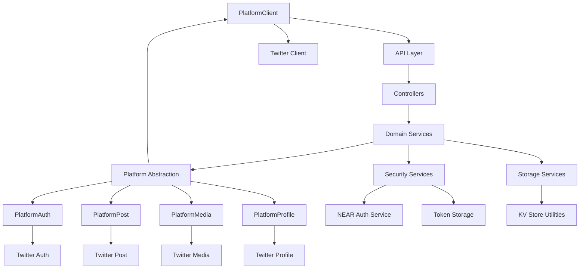
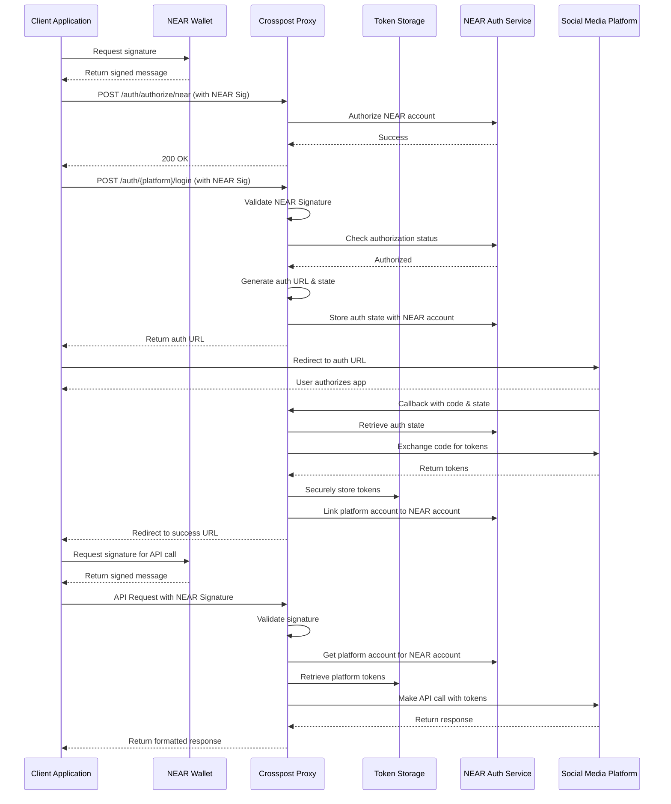

# Open Crosspost Proxy Service

Easily and securely connect your app to social media platforms using NEAR wallet authentication. No
more handling OAuth tokens!

## What It Does

- Acts as a secure bridge between your app and platforms that use OAuth 2.0 PKCE
- Handles OAuth authentication, token refreshes, and rate limits for you
- Uses your NEAR wallet signature to authorize actions, and platform keys safe on the server

## Quick Start

### Prerequisites

- [Deno](https://deno.land/) (latest version)
- [Bun](https://bun.sh/) (for package development and monorepo orchestration, lol ik)
- NEAR Wallet

### Setup & Run

```bash
# Create .env file with required variables
cp .env.example .env

# Install dependencies
bun install

# Start the development server (API, SDK, and Types in watch mode)
bun run dev

# Or start just the API
deno task dev

# Run tests
bun run test
```

## Integration

This project provides two packages to help you integrate with the Crosspost API:

### @crosspost/types

TypeScript type definitions for the API, including request/response types, common types, and helper
functions. See the [Types Documentation](./packages/types/README.md) for details.

```typescript
import { CreatePostRequest, PlatformName } from '@crosspost/types';

const request: CreatePostRequest = {
  targets: [{ platform: 'twitter', userId: 'your-twitter-id' }],
  content: [{ text: 'Hello, world!' }],
};
```

### @crosspost/sdk

A client SDK that simplifies interaction with the API, handling authentication, requests, and error
management. See the [SDK Documentation](./packages/sdk/README.md) for detailed usage instructions.

```typescript
import { CrosspostClient } from '@crosspost/sdk';

const client = new CrosspostClient({
  nearAuthData: {
    accountId: 'your-account.near',
    publicKey: 'ed25519:...',
    signature: '...',
    message: '...',
  },
});

// Create a post on Twitter
await client.post.createPost({
  targets: [{ platform: 'twitter', userId: 'your-twitter-id' }],
  content: [{ text: 'Hello from Crosspost!' }],
});
```

## Architecture

The service uses a layered architecture with clear separation of concerns, to standardize
authentication and social interactions and isolate platform-specific implementations:



## Authentication Flow


