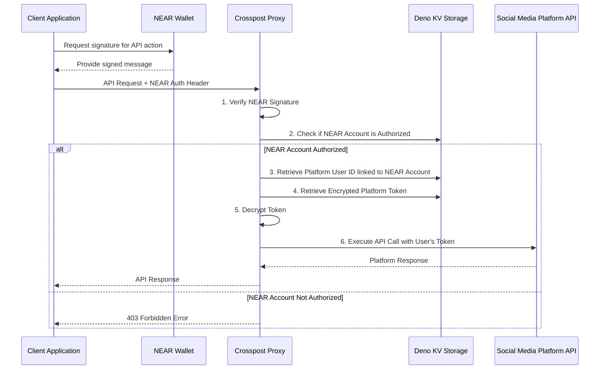

# open crosspost proxy service

Easily and securely connect your app to social media platforms (like Twitter) using NEAR wallet
authentication. No more handling OAuth tokens on the client!

## What It Does

- Acts as a secure bridge between your app and platforms like Twitter
- Handles OAuth authentication, token refreshes, and rate limits for you
- Uses your NEAR wallet signature to authorize actions, keeping platform keys safe on the server
- Built with Deno and designed to run efficiently on the edge (Deno Deploy)

## Quick Start

### Prerequisites

- [Deno](https://deno.land/) (latest version)
- NEAR Wallet
- Twitter Developer Account (for Twitter API access)

### Setup & Run

```bash
# Clone the repository
git clone https://github.com/your-org/crosspost-proxy.git
cd crosspost-proxy

# Create .env file with required variables
cp .env.example .env
# Edit .env with your credentials

# Start the development server
deno task dev

# Run tests (when available)
deno task test
```

### Essential Environment Variables

```
TWITTER_CLIENT_ID=your_client_id
TWITTER_CLIENT_SECRET=your_client_secret

ENCRYPTION_KEY=your_encryption_key

ALLOWED_ORIGINS=http://localhost:3000,https://yourdomain.com
```

## How It Works

### Authentication Flow



### Three Simple Steps

1. **Authorize Your NEAR Account** (one-time setup)

   ```bash
   POST /auth/authorize/near
   ```

   Include your NEAR signature in the header.

2. **Connect a Platform Account** (for each platform)

   ```bash
   POST /auth/twitter/login
   ```

   Include your NEAR signature. This redirects through Twitter's OAuth flow.

3. **Make API Calls** (using your NEAR signature)

   ```bash
   POST /api/post
   ```

   Include the `Authorization` header in all requests.

## Core API Endpoints

### Authentication

```bash
POST /auth/authorize/near          # Authorize your NEAR account
POST /auth/{platform}/login        # Connect a platform account (e.g., twitter)
GET /auth/accounts                 # List accounts connected to your NEAR wallet
```

### Posting

```bash
POST /api/post                     # Create a post
```

Example request:

````json
{
  "platform": "twitter",
  "content": "Hello world from Crosspost Proxy!",
  "mediaIds": ["optional-media-id-if-uploading-media"]
}

```bash
Required header: `Authorization: Bearer ${JSON.stringify(signature)}`

```bash
POST /api/post/like/:id            # Like a post
POST /api/post/reply               # Reply to a post
POST /api/post/repost              # Repost content
DELETE /api/post/:id               # Delete a post
````

### Media

```bash
POST /api/media/upload             # Upload media for attaching to posts
GET /api/media/:id/status          # Check media upload status
```

For all endpoints and details, see the OpenAPI Specification available at `/openapi.json` when
running the server.

## SDK Packages

We provide a set of SDK packages to make it easy to interact with the Crosspost API:

### @crosspost/types

Shared TypeScript type definitions for the Crosspost API ecosystem.

```bash
# Install
bun add @crosspost/types
```

```typescript
// Import types
import { PostRequest, PostResponse, PlatformName } from '@crosspost/types';

// Use types in your code
const request: PostRequest = {
  platform: 'twitter',
  content: {
    text: 'Hello, world!'
  }
};
```

### @crosspost/near-simple-signing

NEAR wallet signature generation utility for Crosspost API authentication.

```bash
# Install
bun add @crosspost/near-simple-signing
```

```typescript
// Initialize the signer
const signer = new NearSigner({
  networkId: 'testnet',
  nodeUrl: 'https://rpc.testnet.near.org',
  walletUrl: 'https://wallet.testnet.near.org'
});

// Connect to NEAR wallet
await signer.connect();

// Generate a signature for authentication
const authHeader = await signer.createAuthHeader('Hello, world!');
```

### @crosspost/sdk

Main client SDK for interacting with the Crosspost API.

```bash
# Install
bun add @crosspost/sdk
```

```typescript
// Initialize the SDK
const client = new CrosspostClient({
  baseUrl: 'https://api.crosspost.example',
  auth: {
    type: 'near',
    signer: signer
  }
});

// Create a post on Twitter
const response = await client.twitter.createPost({
  content: {
    text: 'Hello from Crosspost SDK!'
  }
});
```

## Development

### SDK Development

The SDK packages are located in the `packages` directory:

```
packages/
  ├── types/            # Shared type definitions
  ├── near-simple-signing/ # NEAR signature generation
  └── sdk/              # Main API client
```

To work on the SDK packages:

```bash
# Install dependencies for all packages
cd packages
bun install

# Build all packages
bun run build

# Run development mode
bun run dev

# Run tests
bun run test
```

See the individual package READMEs for more details:
- [@crosspost/types](./packages/types/README.md)
- [@crosspost/near-simple-signing](./packages/near-simple-signing/README.md)
- [@crosspost/sdk](./packages/sdk/README.md)

## Extending & Contributing

This project uses a platform-agnostic design, making it easy to add support for additional social
media platforms beyond Twitter.

Want to add support for LinkedIn, Mastodon, or another platform? Contributions are welcome! Just
implement the platform interfaces in `src/infrastructure/platform/abstract/`.

You can also contribute to the SDK packages by implementing additional platform clients or enhancing
the existing functionality.

## License

MIT
