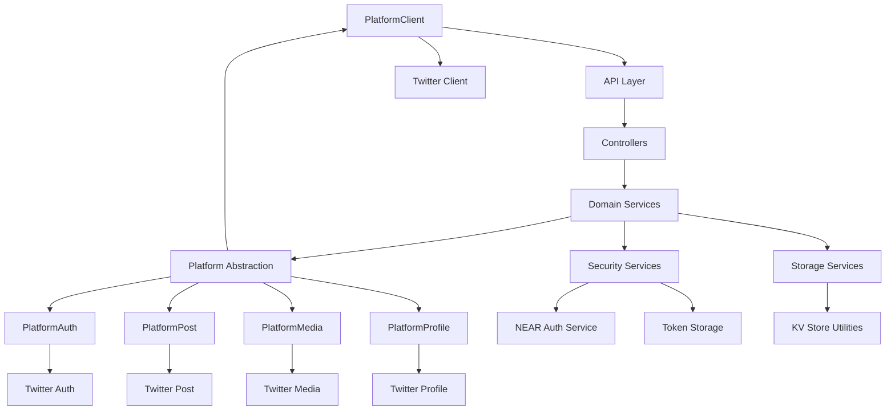
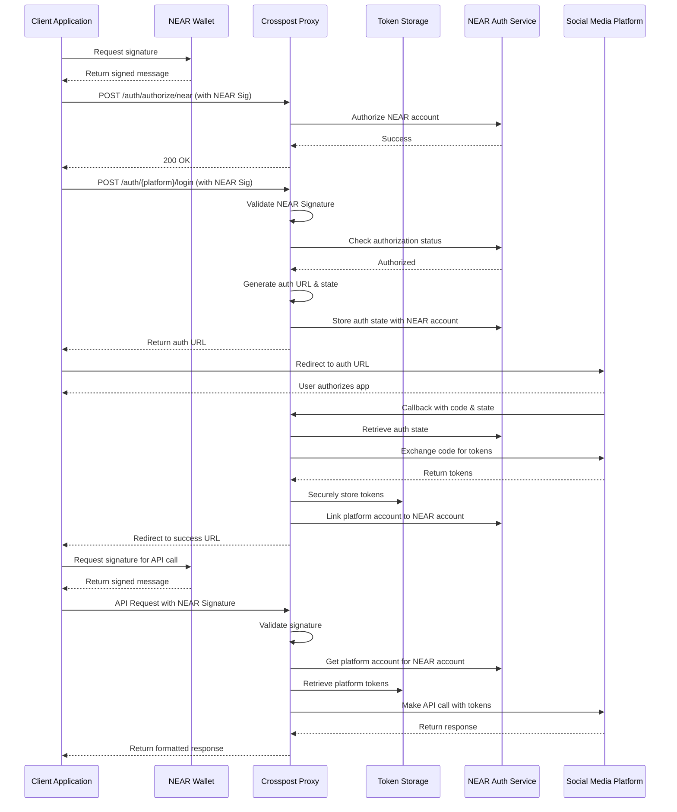

# Open Crosspost Proxy Service

Easily and securely connect your app to social media platforms (like Twitter) using NEAR wallet
authentication. No more handling OAuth tokens on the client!

## What It Does

- Acts as a secure bridge between your app and platforms like Twitter
- Handles OAuth authentication, token refreshes, and rate limits for you
- Uses your NEAR wallet signature to authorize actions, keeping platform keys safe on the server
- Built with Deno and designed to run efficiently on the edge (Deno Deploy)

## Quick Start

### Prerequisites

- [Deno](https://deno.land/) (latest version)
- NEAR Wallet
- Twitter Developer Account (for Twitter API access)

### Setup & Run

```bash
# Create .env file with required variables
cp .env.example .env
# Edit .env with your credentials

# Start the development server
deno task dev

# Run tests
deno task test
```

### Essential Environment Variables

```bash
TWITTER_CLIENT_ID=your_client_id
TWITTER_CLIENT_SECRET=your_client_secret

ENCRYPTION_KEY=your_encryption_key

ALLOWED_ORIGINS=http://localhost:3000,https://yourdomain.com
```

## Architecture

The service uses a layered architecture with clear separation of concerns:



## Authentication Flow



### Three Simple Steps

1. **Authorize Your NEAR Account** (one-time setup)

   ```bash
   POST /auth/authorize/near
   ```

   Include your NEAR signature in the header.

2. **Connect a Platform Account** (for each platform)

   ```bash
   POST /auth/twitter/login
   ```

   Include your NEAR signature. This redirects through Twitter's OAuth flow.

3. **Make API Calls** (using your NEAR signature)

   ```bash
   POST /api/post
   ```

   Include the `Authorization` header in all requests.

## Core API Endpoints

### Authentication

```bash
POST /auth/authorize/near          # Authorize your NEAR account
POST /auth/{platform}/login        # Connect a platform account (e.g., twitter)
GET /auth/accounts                 # List accounts connected to your NEAR wallet
```

### Posting

```bash
POST /api/post                     # Create a post
```

Example request:

```json
{
  "platform": "twitter",
  "content": {
    "text": "Hello world from Crosspost Proxy!",
    "media": [
      {
        "type": "image",
        "body": "https://example.com/image.jpg"
      }
    ]
  }
}
```

All requests require the Authorization header with your NEAR signature.

## SDK Packages

We provide three SDK packages to simplify integration:

### @crosspost/types

```typescript
import { PlatformName, PostCreateRequest } from '@crosspost/types';

const request: PostCreateRequest = {
  platform: 'twitter',
  content: {
    text: 'Hello, world!',
  },
};
```

### @crosspost/near-simple-signing

```typescript
import { NearSigner } from '@crosspost/near-simple-signing';

const signer = new NearSigner({
  networkId: 'testnet',
  nodeUrl: 'https://rpc.testnet.near.org',
  walletUrl: 'https://wallet.testnet.near.org',
});

await signer.connect();
const authHeader = await signer.createAuthHeader();
```

### @crosspost/sdk

```typescript
import { CrosspostClient } from '@crosspost/sdk';

const client = new CrosspostClient({
  baseUrl: 'https://api.crosspost.example',
  auth: {
    type: 'near',
    signer: signer,
  },
});

const response = await client.twitter.createPost({
  content: {
    text: 'Hello from Crosspost SDK!',
  },
});
```

## Extending the Platform

The project uses a platform-agnostic design, making it easy to add support for additional social
media platforms:

1. Implement the platform interfaces in `src/infrastructure/platform/abstract/`
2. Add the platform-specific client to the SDK
3. Update the platform enum in the types package

## License

MIT
