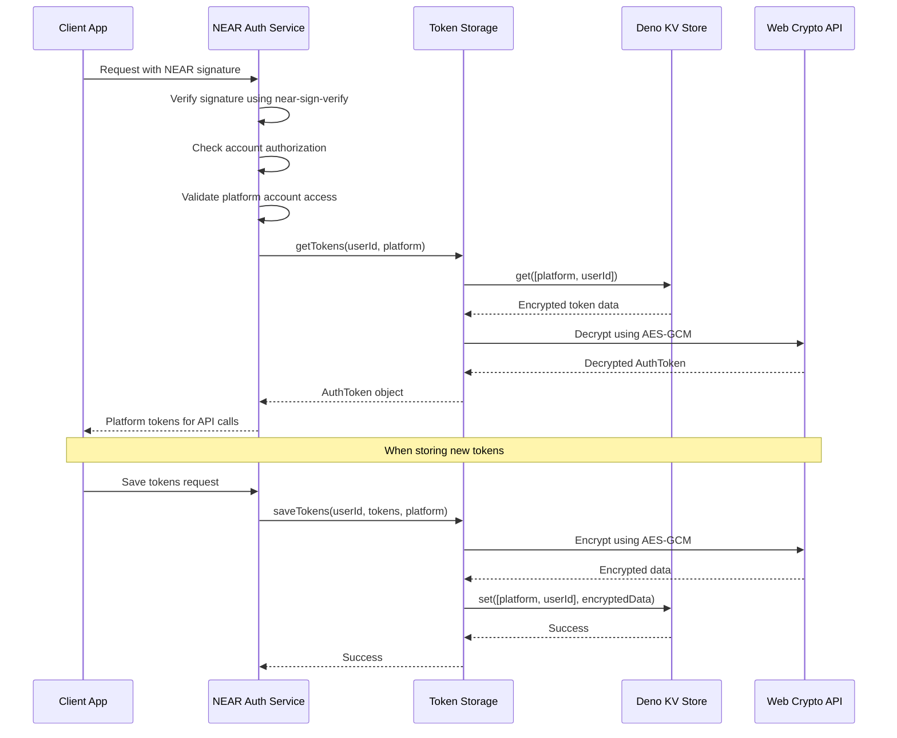

# Auth Token Storage

A secure OAuth token storage system that uses NEAR wallet signatures for authentication and AES-GCM
encryption for token protection.

## Overview

The `TokenStorage` class provides encrypted storage and retrieval of OAuth tokens (OAuth1 and
OAuth2) for social media platforms. Access to these tokens is protected by NEAR signature
verification, ensuring only authorized NEAR accounts can access their linked platform tokens.

## Architecture



## Key Features

### 🔐 **NEAR Signature Authentication**

- Uses `near-sign-verify` library to validate NEAR wallet signatures
- Only authorized NEAR accounts can access their linked platform tokens
- Signature validation happens before any token operations

### 🛡️ **AES-GCM Encryption**

- All OAuth tokens are encrypted before storage using Web Crypto API
- Uses AES-GCM with 256-bit keys derived from SHA-256
- Each token has a unique 12-byte initialization vector (IV)

### 📝 **Versioned Encryption**

- Supports encryption format versioning for future upgrades
- Current version (0x01) includes version byte + IV + encrypted data
- Backward compatibility with legacy format

### 🏷️ **Platform-Specific Storage**

- Tokens stored with platform-specific keys: `[platform, userId]`
- Supports multiple platforms (Twitter, etc.) per user
- Isolated storage prevents cross-platform token access

### 📊 **Comprehensive Logging**

- All token operations (GET, SAVE, DELETE, CHECK) are logged
- Includes success/failure status and error messages
- Audit trail for security monitoring

## Token Types

```typescript
export enum TokenType {
  OAUTH1 = 'oauth1',
  OAUTH2 = 'oauth2',
}

export interface AuthToken {
  accessToken: string;
  refreshToken?: string; // OAuth2 refresh token
  tokenSecret?: string; // OAuth1 token secret
  expiresAt?: number; // Token expiration timestamp
  scope?: string | string[]; // OAuth scopes
  tokenType: TokenType | string;
}
```

## Security Model

### Access Control Flow

1. **NEAR Signature Verification**: Client signs request with NEAR wallet
2. **Account Authorization**: Verify NEAR account is authorized to use the service
3. **Platform Account Linking**: Check if NEAR account has access to the requested platform account
4. **Token Decryption**: Decrypt and return tokens only after all checks pass

### Encryption Details

- **Algorithm**: AES-GCM (Galois/Counter Mode)
- **Key Size**: 256-bit (derived from SHA-256 if needed)
- **IV Size**: 12 bytes (96 bits) - randomly generated per encryption
- **Format**: `[version_byte][12_byte_iv][encrypted_data]`
- **Encoding**: Base64 for storage

## Usage Examples

### Basic Token Operations

```typescript
import { TokenStorage } from './auth-token-storage.ts';
import { PrefixedKvStore } from '../../utils/kv-store.utils.ts';
import { TokenAccessLogger } from '../security/token-access-logger.ts';

// Initialize storage
const kv = await Deno.openKv();
const tokenStore = new PrefixedKvStore(kv, ['tokens']);
const logger = new TokenAccessLogger(kv);
const storage = new TokenStorage('your-encryption-key', tokenStore, logger);

// Save OAuth2 tokens
await storage.saveTokens('twitter_user_123', {
  accessToken: 'oauth2_access_token',
  refreshToken: 'oauth2_refresh_token',
  expiresAt: Date.now() + 3600000, // 1 hour
  tokenType: TokenType.OAUTH2,
  scope: ['read', 'write'],
}, 'twitter');

// Retrieve tokens
const tokens = await storage.getTokens('twitter_user_123', 'twitter');
console.log('Access token:', tokens.accessToken);

// Check if tokens exist
const hasTokens = await storage.hasTokens('twitter_user_123', 'twitter');

// Delete tokens
await storage.deleteTokens('twitter_user_123', 'twitter');
```

### Integration with NEAR Auth Service

```typescript
import { NearAuthService } from '../security/near-auth-service.ts';

// The NEAR Auth Service handles the complete flow
const nearAuth = new NearAuthService(tokenStorage, nearAuthKvStore);

// In your API endpoint
app.get('/api/user/tokens', async (c) => {
  // Validate NEAR signature and get authorized account
  const { signerId } = await nearAuth.extractAndValidateNearAuth(c);

  // Get platform account linked to NEAR account
  const linkedAccounts = await nearAuth.getLinkedAccounts(signerId);

  // Retrieve tokens for the linked account
  const tokens = await nearAuth.getTokens(
    linkedAccounts[0].userId,
    linkedAccounts[0].platform,
  );

  return c.json({ tokens });
});
```

## Error Handling

The storage system provides specific error types for different failure scenarios:

- **TokenNotFoundError**: Tokens don't exist for the user/platform combination
- **TokenRetrievalError**: Failed to decrypt or retrieve tokens
- **Encryption/Decryption Errors**: Crypto operations failed

All errors are logged with appropriate context for debugging and security monitoring.

## Dependencies

- **near-sign-verify**: NEAR signature validation
- **Web Crypto API**: AES-GCM encryption/decryption
- **Deno KV**: Persistent storage backend
- **PrefixedKvStore**: Key namespacing utility
- **TokenAccessLogger**: Security audit logging
