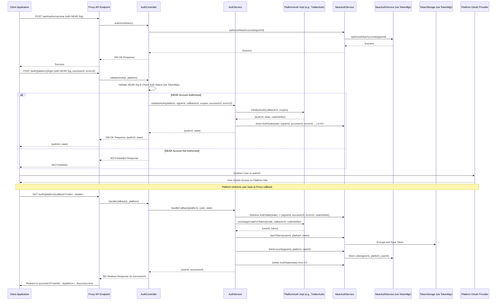
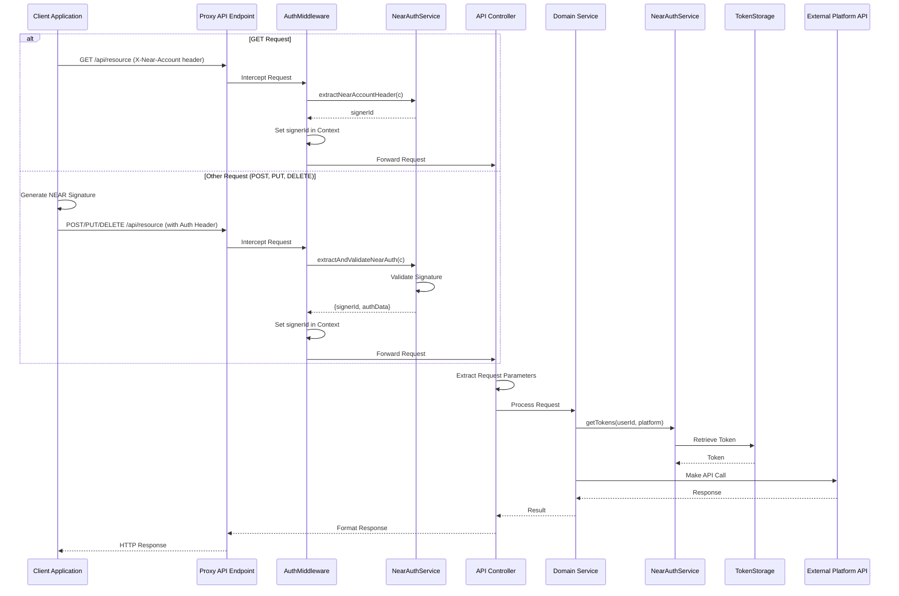

# Authentication and API Call Flows

This document outlines the key sequence of events for user authentication, platform account linking,
and subsequent API calls within the Social Media API Proxy.

## Flow 1: Initial NEAR Account Authorization & Platform Account Linking

This flow describes how a user authorizes their NEAR account with the proxy and then links a
specific social media platform account (e.g., Twitter) to it.

## Flow 2: API Calls with Method-Based Authentication

This flow describes how an authorized client application makes API calls using either the simplified
GET request authentication or full NEAR signature authentication for other methods.

**Description:**

1. **GET Request Authentication:**
   - Client includes X-Near-Account header
   - AuthMiddleware extracts NEAR account from header
   - No signature validation required
   - Sets signerId in context for downstream use

2. **Other Request Authentication:**
   - Client generates NEAR signature
   - AuthMiddleware performs full signature validation
   - Validates authorization status
   - Sets signerId in context for downstream use

3. **Common Processing:**
   - Controller extracts necessary parameters
   - Service processes request using signerId from context
   - Token retrieval and platform API calls remain unchanged
   - Response formatting follows standard patterns

4. **Security Considerations:**
   - GET requests use simplified authentication for read operations
   - Write operations maintain strong security with signature validation
   - Both paths provide consistent context for downstream processing
   - Error handling remains uniform across both paths

5. **Implementation Notes:**
   - AuthMiddleware determines authentication path based on HTTP method
   - NearAuthService provides both header extraction and signature validation
   - Context setting remains consistent for uniform downstream handling
   - Error responses maintain standard format across both paths
