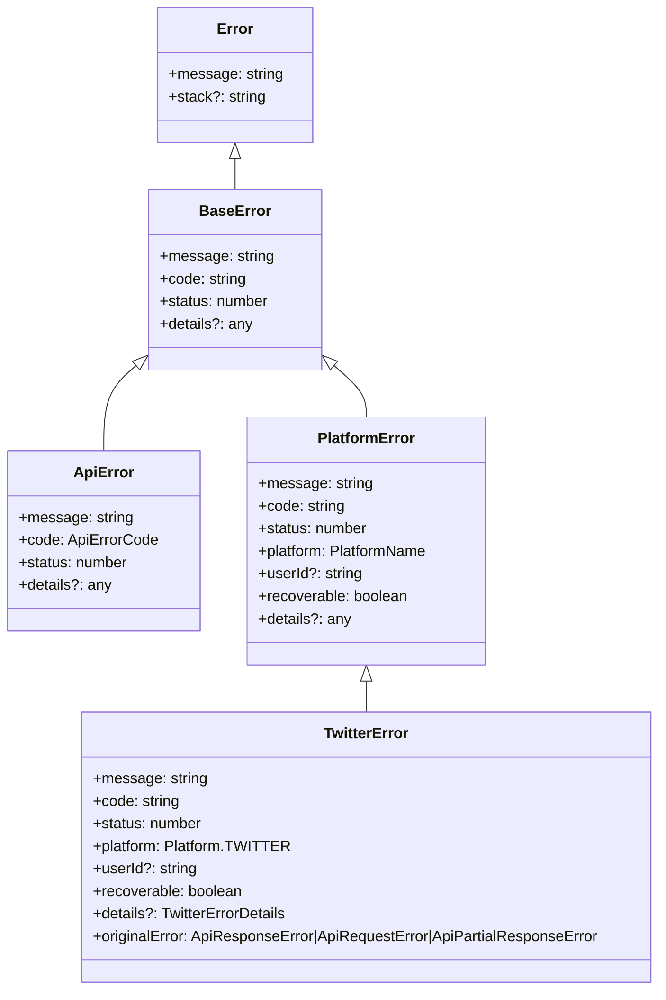

# Error Handling System

## Overview

The application uses a hierarchical error handling system to provide consistent, informative, and developer-friendly error responses. The system includes standardized error codes, consistent response formats, and proper HTTP status codes.

## Error Hierarchy

The error hierarchy is designed to provide a clear structure for different types of errors that can occur in the application:



## Error Types

### BaseError

The base error class that all other error classes extend from. It provides the basic structure for all errors in the application.

```typescript
class BaseError extends Error {
  code: string;
  status: number;
  details?: any;

  constructor(message: string, code: string, status = 500, details?: any) {
    super(message);
    this.name = this.constructor.name;
    this.code = code;
    this.status = status;
    this.details = details;
  }
}
```

### ApiError

Represents application-level errors that are not specific to any platform.

```typescript
class ApiError extends BaseError {
  constructor(message: string, code: ApiErrorCode, status = 500, details?: any) {
    super(message, code, status, details);
  }
}
```

### PlatformError

Represents errors that are specific to a platform (e.g., Twitter, LinkedIn).

```typescript
class PlatformError extends BaseError {
  platform: PlatformName;
  userId?: string;
  recoverable: boolean;

  constructor(
    message: string,
    code: string,
    platform: PlatformName,
    status = 500,
    userId?: string,
    recoverable = false,
    details?: any
  ) {
    super(message, code, status, details);
    this.platform = platform;
    this.userId = userId;
    this.recoverable = recoverable;
  }
}
```

### TwitterError

Represents errors that are specific to the Twitter platform. It maps Twitter API errors to our standardized format.

```typescript
class TwitterError extends PlatformError {
  originalError: ApiResponseError | ApiRequestError | ApiPartialResponseError;

  constructor(
    error: ApiResponseError | ApiRequestError | ApiPartialResponseError,
    userId?: string
  ) {
    // Map Twitter error to our standardized format
    const { message, code, status, recoverable, details } = mapTwitterError(error);
    
    super(
      message,
      code,
      Platform.TWITTER,
      status,
      userId,
      recoverable,
      details
    );
    
    this.originalError = error;
  }
}
```

## Error Codes

The application uses standardized error codes to provide machine-readable error identification:

```typescript
enum ApiErrorCode {
  // General errors
  UNKNOWN_ERROR = 'UNKNOWN_ERROR',
  INTERNAL_ERROR = 'INTERNAL_ERROR',
  VALIDATION_ERROR = 'VALIDATION_ERROR',
  NOT_FOUND = 'NOT_FOUND',
  
  // Authentication errors
  UNAUTHORIZED = 'UNAUTHORIZED',
  FORBIDDEN = 'FORBIDDEN',
  TOKEN_EXPIRED = 'TOKEN_EXPIRED',
  TOKEN_INVALID = 'TOKEN_INVALID',
  
  // Rate limiting errors
  RATE_LIMITED = 'RATE_LIMITED',
  
  // Platform errors
  PLATFORM_ERROR = 'PLATFORM_ERROR',
  PLATFORM_UNAVAILABLE = 'PLATFORM_UNAVAILABLE',
  
  // Content errors
  CONTENT_POLICY_VIOLATION = 'CONTENT_POLICY_VIOLATION',
  DUPLICATE_CONTENT = 'DUPLICATE_CONTENT',
  
  // Media errors
  MEDIA_ERROR = 'MEDIA_ERROR',
  MEDIA_TOO_LARGE = 'MEDIA_TOO_LARGE',
  MEDIA_TYPE_UNSUPPORTED = 'MEDIA_TYPE_UNSUPPORTED',
}
```

## Response Formats

The application uses consistent response formats for success and error responses:

### Success Response

```typescript
{
  "success": true,
  "data": {
    "platform": "twitter",
    "userId": "12345",
    "status": "success",
    "result": {
      "postId": "abc123",
      "postUrl": "https://twitter.com/i/web/status/abc123",
      "createdAt": "2023-04-01T12:00:00.000Z"
    }
  }
}
```

### Error Response

```typescript
{
  "success": false,
  "errors": [
    {
      "platform": "twitter",
      "userId": "12345",
      "status": "error",
      "error": "Failed to create thread",
      "errorCode": "CONTENT_POLICY_VIOLATION",
      "recoverable": false,
      "details": {
        "twitterErrorCode": 187,
        "twitterMessage": "Status is a duplicate"
      }
    }
  ]
}
```

### Multi-Status Response (Partial Success/Failure)

```typescript
{
  "success": true,
  "data": {
    "summary": {
      "total": 3,
      "succeeded": 2,
      "failed": 1
    },
    "results": [
      {
        "platform": "twitter",
        "userId": "12345",
        "status": "success",
        "result": {
          "postId": "abc123",
          "postUrl": "https://twitter.com/i/web/status/abc123",
          "createdAt": "2023-04-01T12:00:00.000Z"
        }
      },
      {
        "platform": "linkedin",
        "userId": "67890",
        "status": "success",
        "result": {
          "postId": "def456",
          "postUrl": "https://linkedin.com/post/def456",
          "createdAt": "2023-04-01T12:00:00.000Z"
        }
      }
    ],
    "errors": [
      {
        "platform": "facebook",
        "userId": "54321",
        "status": "error",
        "error": "Failed to create post",
        "errorCode": "RATE_LIMITED",
        "recoverable": true,
        "details": {
          "retryAfter": 3600
        }
      }
    ]
  }
}
```

## HTTP Status Codes

The application uses appropriate HTTP status codes for different types of responses:

- **200 OK**: Complete success
- **207 Multi-Status**: Partial success/failure
- **400 Bad Request**: Validation errors and complete failures
- **401 Unauthorized**: Authentication errors
- **403 Forbidden**: Authorization errors
- **404 Not Found**: Resource not found
- **429 Too Many Requests**: Rate limiting
- **500 Internal Server Error**: Internal server errors

## Twitter-Specific Error Handling

The application includes specialized error handling for Twitter API errors:

```typescript
function mapTwitterError(
  error: ApiResponseError | ApiRequestError | ApiPartialResponseError
): {
  message: string;
  code: string;
  status: number;
  recoverable: boolean;
  details: any;
} {
  // Handle different types of Twitter errors
  if (error instanceof ApiResponseError) {
    // Handle Twitter API response errors
    if (error.rateLimitError) {
      return {
        message: 'Twitter rate limit exceeded',
        code: ApiErrorCode.RATE_LIMITED,
        status: 429,
        recoverable: true,
        details: {
          rateLimit: error.rateLimit,
          retryAfter: error.rateLimit?.reset
            ? new Date(error.rateLimit.reset * 1000).getTime() - Date.now()
            : undefined,
        },
      };
    }

    if (error.isAuthError) {
      return {
        message: 'Twitter authentication error',
        code: ApiErrorCode.UNAUTHORIZED,
        status: 401,
        recoverable: true,
        details: {
          errors: error.errors,
        },
      };
    }

    // Map specific Twitter error codes
    if (error.errors && error.errors.length > 0) {
      const twitterError = error.errors[0];
      
      // Handle duplicate content
      if (error.hasErrorCode(187)) {
        return {
          message: 'Duplicate content',
          code: ApiErrorCode.DUPLICATE_CONTENT,
          status: 400,
          recoverable: false,
          details: {
            twitterErrorCode: 187,
            twitterMessage: twitterError.message,
          },
        };
      }
      
      // Handle content policy violations
      if (error.hasErrorCode(186)) {
        return {
          message: 'Tweet exceeds maximum allowed length',
          code: ApiErrorCode.CONTENT_POLICY_VIOLATION,
          status: 400,
          recoverable: true,
          details: {
            twitterErrorCode: 186,
            twitterMessage: twitterError.message,
          },
        };
      }
      
      // Default Twitter API error
      return {
        message: twitterError.message || 'Twitter API error',
        code: `TWITTER_ERROR_${twitterError.code || 'UNKNOWN'}`,
        status: error.code,
        recoverable: false,
        details: {
          errors: error.errors,
        },
      };
    }
  } else if (error instanceof ApiRequestError) {
    // Handle Twitter API request errors
    return {
      message: 'Twitter API request error',
      code: ApiErrorCode.PLATFORM_UNAVAILABLE,
      status: 503,
      recoverable: true,
      details: {
        requestError: error.requestError.message,
      },
    };
  } else if (error instanceof ApiPartialResponseError) {
    // Handle Twitter API partial response errors
    return {
      message: 'Twitter API partial response error',
      code: ApiErrorCode.PLATFORM_ERROR,
      status: 500,
      recoverable: true,
      details: {
        responseError: error.responseError.message,
        rawContent: error.rawContent,
      },
    };
  }

  // Default error
  return {
    message: error.message || 'Unknown Twitter error',
    code: ApiErrorCode.PLATFORM_ERROR,
    status: 500,
    recoverable: false,
    details: {
      originalError: error,
    },
  };
}
```

## Best Practices

1. **Use Standardized Error Codes**: Always use the standardized error codes defined in `ApiErrorCode` for machine-readable error identification.
2. **Include Detailed Error Information**: Always include detailed error information, including the error message, code, platform, user ID, and any additional details.
3. **Indicate Recoverability**: Always indicate whether an error is recoverable (temporary/retryable) or not.
4. **Use Appropriate HTTP Status Codes**: Always use appropriate HTTP status codes for different types of responses.
5. **Preserve Original Error Details**: Always preserve the original error details for debugging purposes.
6. **Handle Platform-Specific Errors**: Implement specialized error handling for platform-specific errors.
7. **Use Multi-Status Responses**: Use multi-status responses for batch operations that may have partial success/failure.
