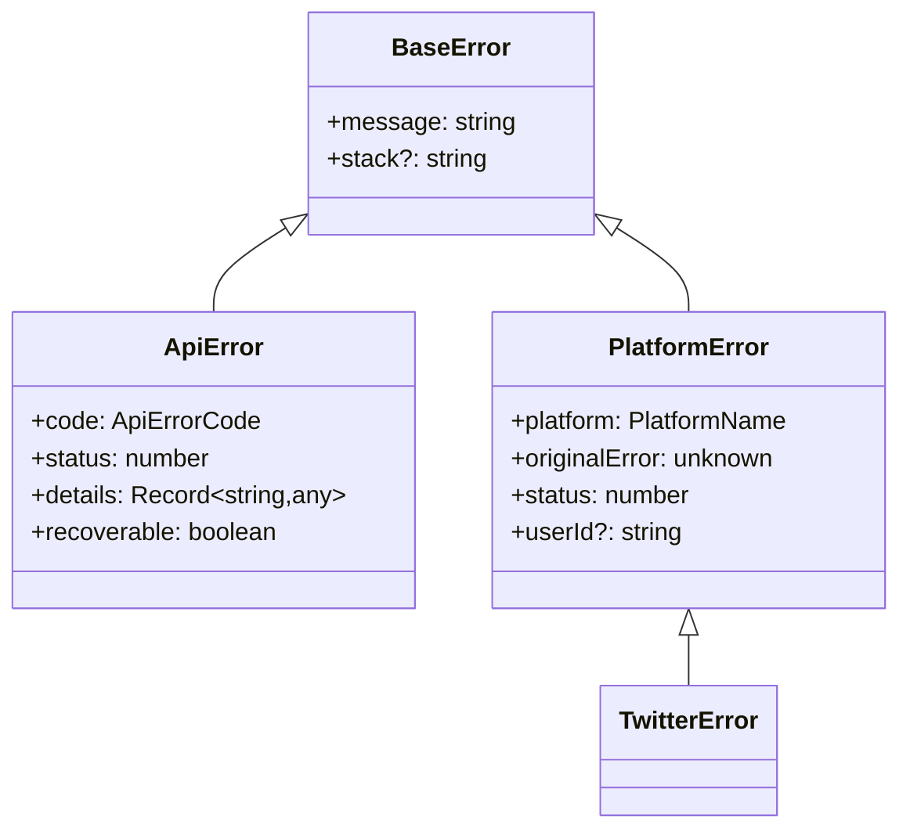
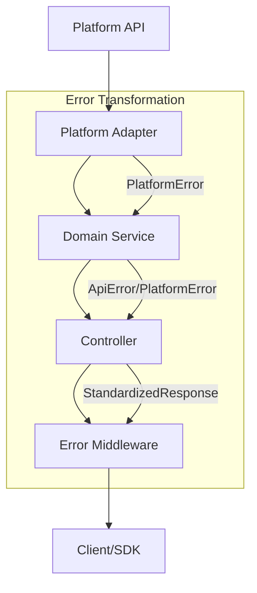

# Open Crosspost Proxy Service: Error Handling Strategy

## Overview

The Open Crosspost Proxy Service implements a comprehensive error handling system that provides
consistent, informative error responses across the API proxy and SDK. The system is built around the
`@crosspost/types` package, which serves as the single source of truth for error types and handling.

## Error Types

### Core Error Classes



1. **BaseError**: Foundation for all custom errors
2. **ApiError**: Application-level errors (validation, auth, etc.)
3. **PlatformError**: Platform-specific errors (rate limits, API errors)

## Error Flow



## Key Features

### 1. Standardized Error Properties

- **code**: Specific error code from ApiErrorCode enum
- **status**: HTTP status code
- **recoverable**: Whether the error is recoverable
- **details**: Additional error context
- **platform**: Source platform for platform errors

### 2. Error Handling Layers

1. **Platform Adapters**: Convert platform errors to PlatformError
2. **Domain Services**: Handle or propagate errors
3. **Controllers**: Format errors into standard responses
4. **Middleware**: Final error catch-all

### 3. SDK Integration

- Receives standardized error responses
- Provides typed error experience
- Maintains error context for UI handling

## SDK Error Utilities

The SDK provides a comprehensive set of error utilities to help client applications handle errors
consistently:

### 1. Error Categories

Errors are grouped into logical categories for easier classification and handling:

```typescript
export const ERROR_CATEGORIES = {
  AUTH: [ApiErrorCode.UNAUTHORIZED, ApiErrorCode.FORBIDDEN],
  VALIDATION: [ApiErrorCode.VALIDATION_ERROR, ApiErrorCode.INVALID_REQUEST],
  NETWORK: [ApiErrorCode.NETWORK_ERROR],
  PLATFORM: [ApiErrorCode.PLATFORM_ERROR, ApiErrorCode.PLATFORM_UNAVAILABLE],
  CONTENT: [ApiErrorCode.CONTENT_POLICY_VIOLATION, ApiErrorCode.DUPLICATE_CONTENT],
  RATE_LIMIT: [ApiErrorCode.RATE_LIMITED],
  POST: [ApiErrorCode.POST_CREATION_FAILED, ApiErrorCode.POST_DELETION_FAILED, ...],
  MEDIA: [ApiErrorCode.MEDIA_UPLOAD_FAILED],
};
```

### 2. Error Type Checking

The SDK provides functions to check error types:

```typescript
// Check if an error belongs to a specific category
isErrorOfCategory(error, ERROR_CATEGORIES.AUTH);

// Specialized error type checkers
isAuthError(error);
isValidationError(error);
isNetworkError(error);
isPlatformError(error);
isContentError(error);
isRateLimitError(error);
isPostError(error);
isMediaError(error);
isRecoverableError(error);
```

### 3. Error Information Extraction

Utilities to extract useful information from errors:

```typescript
// Get a user-friendly error message
const message = getErrorMessage(error, 'Default message');

// Extract error details if available
const details = getErrorDetails(error);
```

### 4. Error Context Enrichment

Utilities to add context to errors:

```typescript
// Add context to an error
const enrichedError = enrichErrorWithContext(error, {
  operation: 'createPost',
  timestamp: Date.now(),
});
```

### 5. API Wrapper

A utility to wrap API calls with consistent error handling:

```typescript
// Wrap an API call with error handling
const result = await apiWrapper(
  async () => {
    // API call implementation
    return await fetch('/api/endpoint');
  },
  { operation: 'fetchData' }, // Optional context
);
```

## Best Practices

1. **Use Proper Error Types**
   - ApiError for application errors
   - PlatformError for platform issues
   - Maintain all required properties

2. **Error Response Format**
   - Use EnhancedErrorResponse type
   - Include detailed error information
   - Preserve error context

3. **Status Code Consistency**
   - Use centralized status code mapping
   - Maintain HTTP semantic meaning
   - Use proper status properties

4. **Client-Side Error Handling**
   - Use the SDK's error utilities for consistent error handling
   - Check error types with the provided functions
   - Add context to errors for better debugging
   - Implement recovery strategies for recoverable errors

## Implementation Example

### Server-Side Error Mapping

```typescript
// Error code to status mapping
export const errorCodeToStatusCode: Record<ApiErrorCode, StatusCode> = {
  [ApiErrorCode.UNKNOWN_ERROR]: 500,
  [ApiErrorCode.VALIDATION_ERROR]: 400,
  [ApiErrorCode.UNAUTHORIZED]: 401,
  [ApiErrorCode.FORBIDDEN]: 403,
  [ApiErrorCode.RATE_LIMITED]: 429,
};
```

### Client-Side Error Handling

```typescript
try {
  await client.post.createPost({ content, platform });
} catch (error) {
  if (isAuthError(error)) {
    // Handle authentication errors
    redirectToLogin();
  } else if (isRateLimitError(error)) {
    // Handle rate limit errors
    showRateLimitMessage(getErrorDetails(error)?.resetTime);
  } else if (isContentError(error)) {
    // Handle content policy violations
    showContentPolicyMessage(getErrorMessage(error));
  } else {
    // Handle other errors
    showGenericErrorMessage(getErrorMessage(error));
  }
}
```
