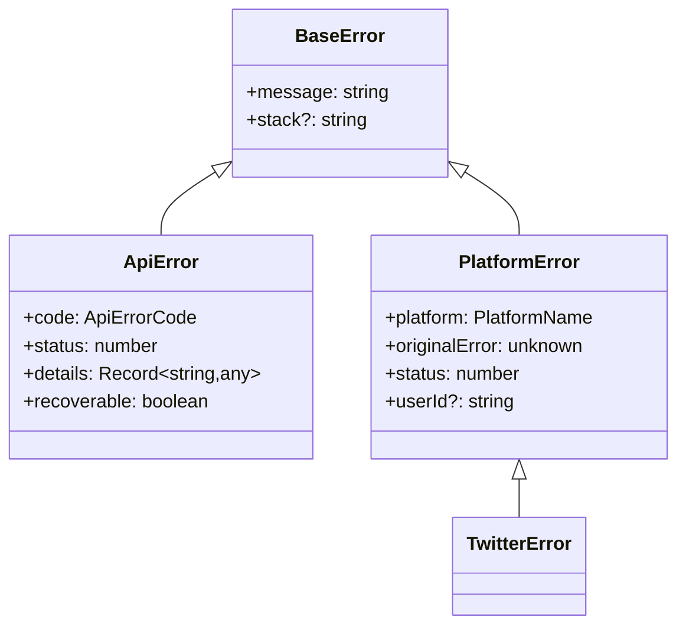
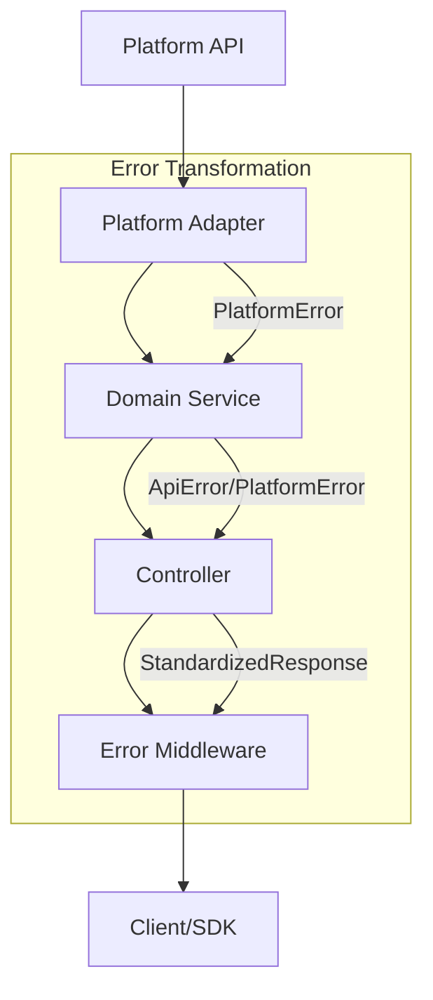

# Open Crosspost Proxy Service: Error Handling Strategy

## Overview

The Open Crosspost Proxy Service implements a comprehensive error handling system that provides
consistent, informative error responses across the API proxy and SDK. The system is built around the
`@crosspost/types` package, which serves as the single source of truth for error types and handling.

## Error Types

### Core Error Classes



1. **BaseError**: Foundation for all custom errors
2. **ApiError**: Application-level errors (validation, auth, etc.)
3. **PlatformError**: Platform-specific errors (rate limits, API errors)

## Error Flow



## Key Features

### 1. Standardized Error Properties

- **code**: Specific error code from ApiErrorCode enum
- **status**: HTTP status code
- **recoverable**: Whether the error is recoverable
- **details**: Additional error context
- **platform**: Source platform for platform errors

### 2. Error Handling Layers

1. **Platform Adapters**: Convert platform errors to PlatformError
2. **Domain Services**: Handle or propagate errors
3. **Controllers**: Format errors into standard responses
4. **Middleware**: Final error catch-all

### 3. SDK Integration

- Receives standardized error responses
- Provides typed error experience
- Maintains error context for UI handling

## Best Practices

1. **Use Proper Error Types**
   - ApiError for application errors
   - PlatformError for platform issues
   - Maintain all required properties

2. **Error Response Format**
   - Use EnhancedErrorResponse type
   - Include detailed error information
   - Preserve error context

3. **Status Code Consistency**
   - Use centralized status code mapping
   - Maintain HTTP semantic meaning
   - Use proper status properties

## Implementation Example

```typescript
// Error code to status mapping
export const errorCodeToStatusCode: Record<ApiErrorCode, StatusCode> = {
  [ApiErrorCode.UNKNOWN_ERROR]: 500,
  [ApiErrorCode.VALIDATION_ERROR]: 400,
  [ApiErrorCode.UNAUTHORIZED]: 401,
  [ApiErrorCode.FORBIDDEN]: 403,
  [ApiErrorCode.RATE_LIMITED]: 429,
};
```
