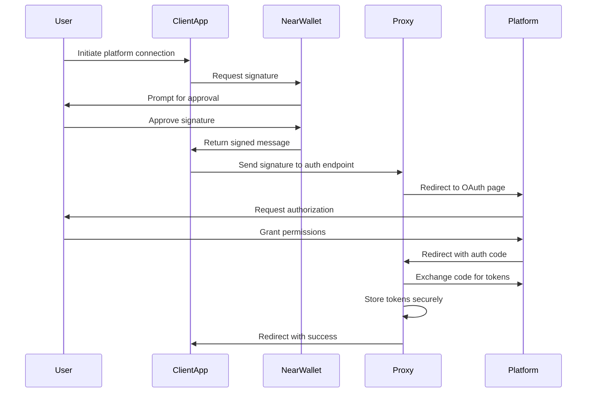
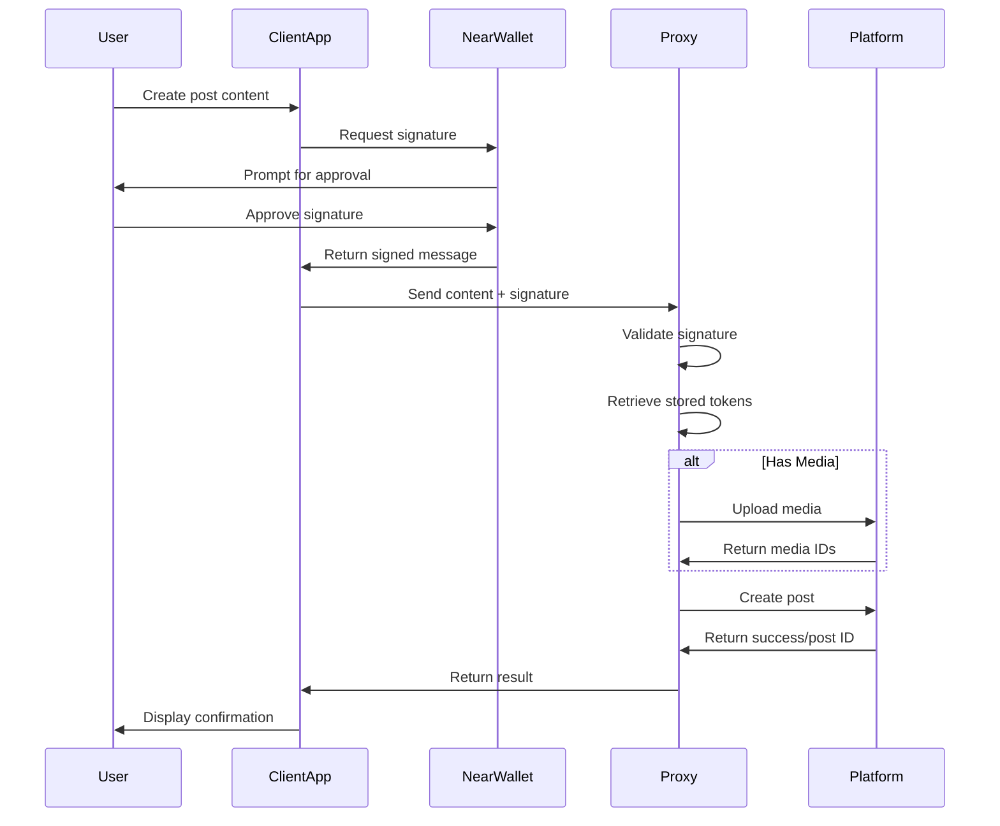

# Open Crosspost Proxy Service: Product Context

## Problem Statement

Integrating directly with social media APIs presents significant challenges for frontend
applications:

- **Security Vulnerabilities**: Exposing OAuth tokens in frontend code creates security risks
- **Complex Rate Limiting**: Managing platform-specific rate limits is difficult from client-side
  code
- **Token Management Challenges**: Securely storing and refreshing tokens is problematic in frontend
  environments
- **CORS Restrictions**: Direct API calls from browsers face cross-origin limitations
- **Duplicated Integration Logic**: Each frontend application must implement the same OAuth flows
  and API handling
- **Media Upload Complexity**: Handling media uploads requires complex, platform-specific
  implementations

## Solution

The Open Crosspost Proxy Service provides a secure bridge between frontend applications and social
media platforms:

- **Secure Token Management**: OAuth tokens remain securely stored on the server, never exposed to
  clients
- **Unified Authentication**: NEAR wallet signatures provide a secure, decentralized authentication
  mechanism
- **Centralized Rate Limiting**: The proxy handles all rate limit tracking and implements
  appropriate backoff strategies
- **Simplified API**: Clients interact with a consistent REST API rather than implementing complex
  OAuth flows
- **Comprehensive Media Handling**: The proxy manages media uploads, including chunked uploads and
  processing
- **Platform Abstraction**: A unified interface allows interaction with multiple social media
  platforms

## User Experience

### For End Users

- **Seamless Authentication**: Simple, secure connection to social media accounts
- **Reliable Performance**: Consistent access to functionality without rate limit errors
- **Enhanced Privacy**: Credentials are securely handled without client exposure
- **Multiple Account Support**: Connect multiple social media accounts to a single NEAR wallet

### For Developers

- **Simple Integration**: Easy-to-use SDK with TypeScript type safety
- **Reduced Security Burden**: No need to handle sensitive OAuth tokens
- **Consistent Reliability**: Built-in handling for rate limits and API changes
- **Comprehensive Functionality**: Access to all major social media features
- **Platform Agnostic**: Single API for multiple social media platforms

## Key Workflows

### Authentication Flow

### Post Creation Flow

## Value Proposition

1. **Enhanced Security**: Properly secured OAuth implementation with no token exposure
2. **Simplified Development**: Reduced implementation complexity with SDK support
3. **Improved Reliability**: Centralized handling of rate limits and API changes
4. **Comprehensive API**: All major social media functions through a unified interface
5. **NEAR Integration**: Decentralized authentication using NEAR wallet signatures
