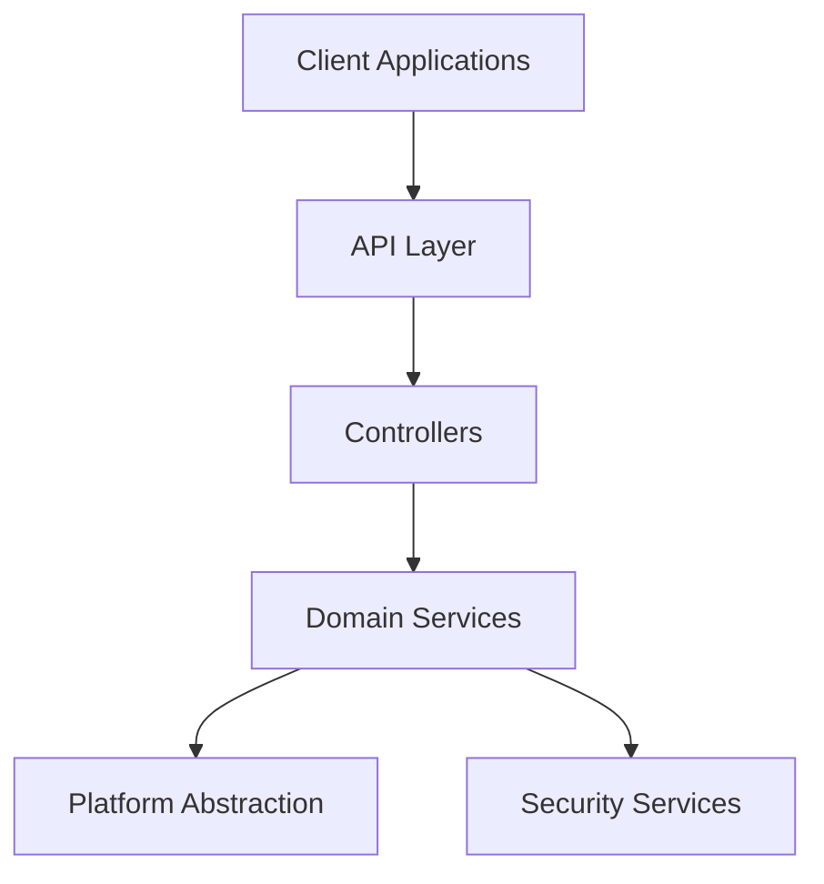

# Open Crosspost Proxy Service: Project Brief

## Project Overview

The Open Crosspost Proxy Service is a secure bridge between frontend applications and social media
platforms. It enables authorized applications to perform actions on behalf of users who have granted
permission, without exposing sensitive OAuth tokens to the client. The service securely stores
tokens, handles refreshes, enforces rate limits, and supports all major API functions including
media uploads. Built with a platform-agnostic architecture, it currently supports Twitter with the
ability to easily extend to other social media platforms.

## Core Requirements

### Authentication & Security

- ✅ OAuth 2.0 flow implementation with social media platforms
- ✅ Secure token storage with encryption
- ✅ Token refresh and revocation support
- ✅ NEAR wallet signature-based authentication
- ✅ Strict CORS policies for client applications

### API Functionality

- ✅ Comprehensive social media actions (post, repost, like, reply, etc.)
- ✅ Media upload handling with chunked uploads
- ✅ Post management (creation, deletion, editing)
- ✅ Social media interaction (likes, replies, quotes)

### Performance & Reliability

- ✅ Efficient rate limiting implementation
- ✅ Graceful error handling with detailed responses
- ✅ Edge-optimized deployment
- ✅ Comprehensive logging and monitoring

### Developer Experience

- ✅ TypeScript SDK with full type safety
- ✅ Simplified authentication flow
- ✅ Consistent API across platforms
- ✅ Comprehensive documentation

## Technical Stack

| Component      | Technology     | Purpose                                              |
| -------------- | -------------- | ---------------------------------------------------- |
| Runtime        | Deno           | JavaScript/TypeScript runtime with built-in security |
| Deployment     | Deno Deploy    | Edge runtime for global performance                  |
| Storage        | Deno KV        | Key-value storage for tokens and configuration       |
| Language       | TypeScript     | Type-safe development                                |
| HTTP Framework | Hono           | Fast, middleware-based routing                       |
| Validation     | Zod            | Schema validation and type generation                |
| Encryption     | jose           | JWT handling and cryptographic operations            |
| Twitter API    | twitter-api-v2 | Twitter API communication                            |

## Architecture

The service uses a layered architecture with clear separation of concerns:

## SDK Packages

The service provides two SDK packages for client integration:

1. **@crosspost/types**: Shared type definitions
2. **@crosspost/sdk**: Main client SDK with platform-specific implementations

## Success Criteria

✅ Secure authentication with social media platforms\
✅ Safe token management with encryption\
✅ Support for all core social media actions\
✅ Proper media upload handling\
✅ Effective rate limit enforcement\
✅ Access restricted to authorized applications\
✅ High performance and reliability\
✅ Comprehensive logging and monitoring\
✅ Platform-agnostic design for extensibility\
✅ Developer-friendly SDK with TypeScript support
