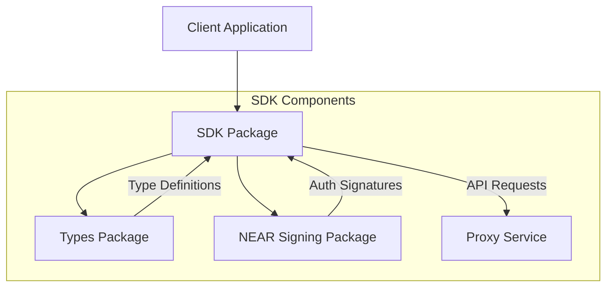
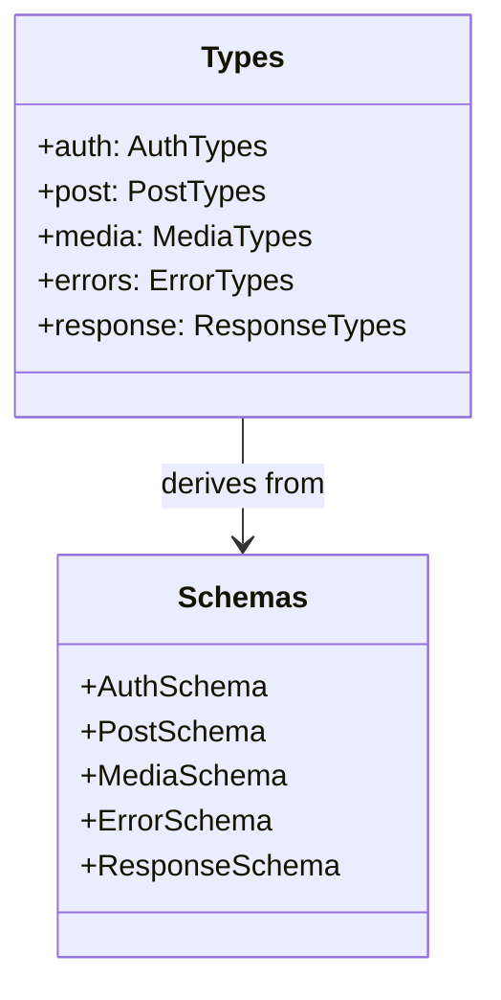
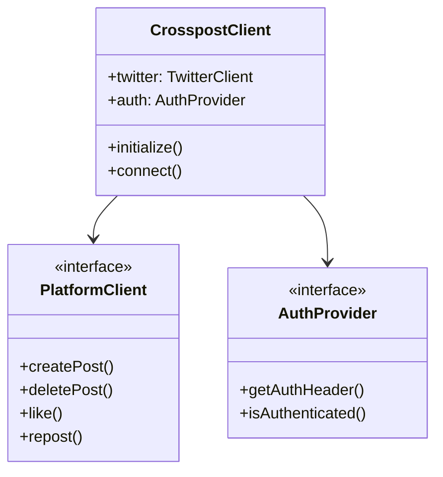
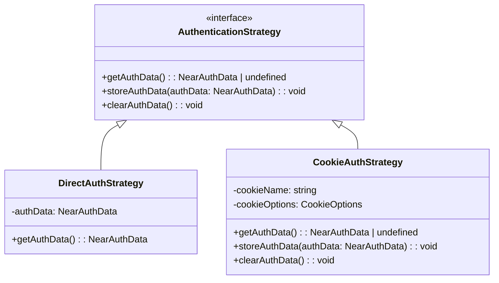

# Open Crosspost Proxy Service: SDK Architecture

## Overview

The SDK architecture provides a modular, type-safe way to interact with the Open Crosspost Proxy
Service. It consists of three core packages that work together to provide a seamless development
experience.



## Core Packages

### 1. @crosspost/types

The foundation package providing shared type definitions and validation schemas.



**Key Features:**

- TypeScript interfaces for all API types
- Zod schemas for runtime validation
- Error type definitions
- Platform-agnostic design
- Zero runtime dependencies

### 2. @crosspost/sdk

Main client SDK for interacting with the proxy service.



**Key Features:**

- Platform-specific clients
- Flexible authentication
- Type-safe operations
- Error handling
- Request/response validation

## Authentication Strategies

The SDK implements a flexible authentication approach with multiple strategies:



The `CrosspostClient` supports two primary authentication methods:

1. **Direct Authentication**: Providing `nearAuthData` directly in the constructor.
2. **Cookie-Based Authentication**: Automatically reading/writing authentication data from a secure
   cookie (`__crosspost_auth`).

This approach allows for flexible usage in both frontend and backend environments:

```typescript
// Direct authentication
const client = new CrosspostClient({
  nearAuthData: myNearAuthData,
});

// Cookie-based authentication (auto-loads from cookie if available)
const client = new CrosspostClient();

// Set authentication explicitly (also stores in cookie)
await client.setAuthentication(nearAuthData);
```

The cookie-based strategy uses secure cookie settings (`SameSite=Lax`, `Secure`, `HttpOnly`) to
protect the authentication data while allowing for persistent sessions. The SDK also supports CSRF
protection by reading a token from a non-HttpOnly cookie (`XSRF-TOKEN`) provided by the backend and
sending it back in the `X-CSRF-Token` header.

## Architecture Benefits

1. **Type Safety**
   - Full TypeScript support
   - Runtime validation
   - Compile-time checks

2. **Modularity**
   - Independent packages
   - Clear responsibilities
   - Flexible integration

3. **Developer Experience**
   - Intuitive API design
   - Comprehensive documentation
   - Consistent patterns

4. **Maintainability**
   - Decoupled components
   - Platform abstraction
   - Centralized types

## Future Enhancements

1. **Additional Platforms**
   - Platform-specific clients
   - Custom functionality
   - Extended capabilities

2. **Enhanced Security**
   - Key rotation support
   - Token management
   - Access controls

3. **Performance Optimization**
   - Request batching
   - Caching strategies
   - Rate limit handling
