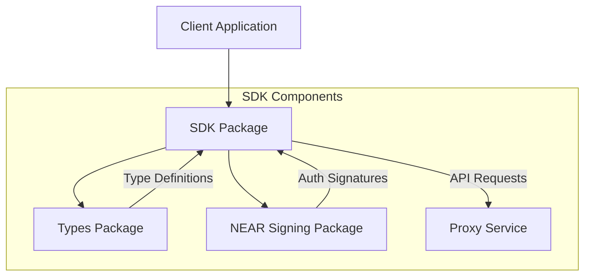
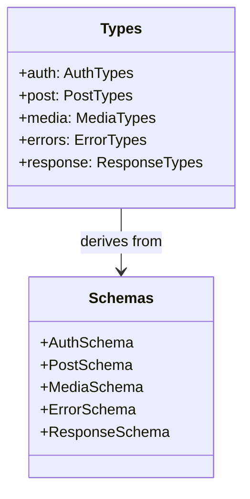
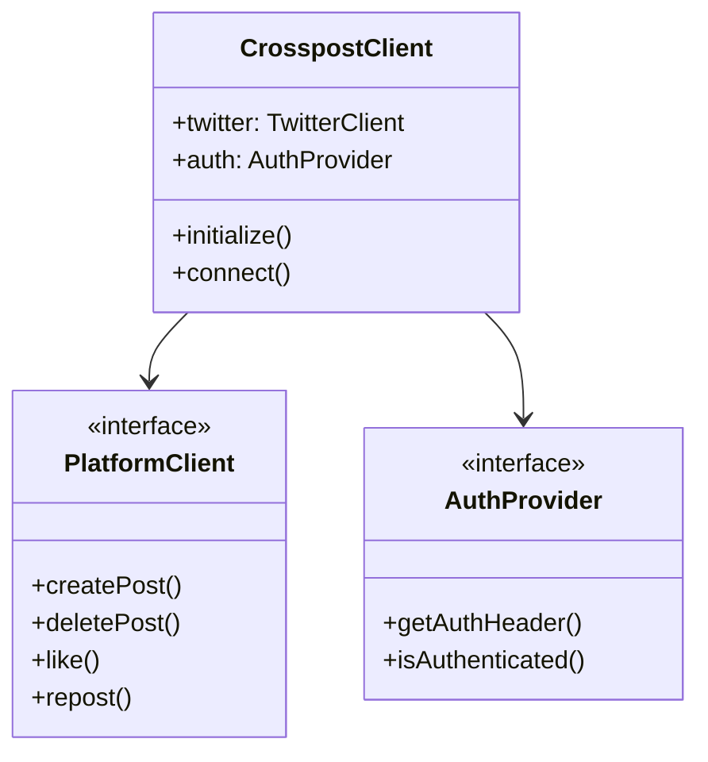
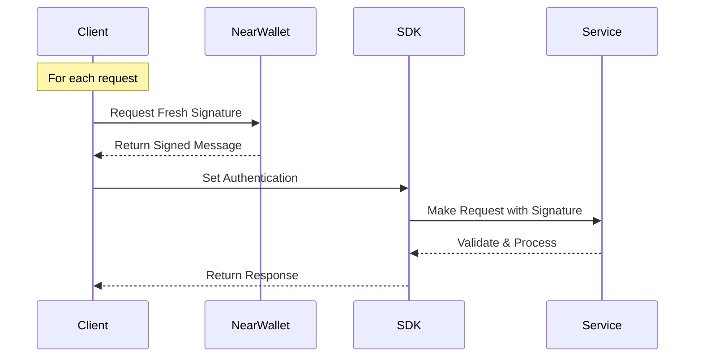

# Open Crosspost Proxy Service: SDK Architecture

## Overview

The SDK architecture provides a modular, type-safe way to interact with the Open Crosspost Proxy
Service. It consists of three core packages that work together to provide a seamless development
experience.



## Core Packages

### 1. @crosspost/types

The foundation package providing shared type definitions and validation schemas.



**Key Features:**

- TypeScript interfaces for all API types
- Zod schemas for runtime validation
- Error type definitions
- Platform-agnostic design
- Zero runtime dependencies

### 2. @crosspost/sdk

Main client SDK for interacting with the proxy service.



**Key Features:**

- Platform-specific clients
- Flexible authentication
- Type-safe operations
- Error handling
- Request/response validation

## Authentication Strategy

The SDK uses direct authentication with per-request signatures for enhanced security:



The `CrosspostClient` uses direct authentication where each request requires fresh `NearAuthData`:

```typescript
// Initialize client
const client = new CrosspostClient();

// Before making authenticated requests
client.setAuthentication({
  accountId: 'account.near',
  publicKey: 'ed25519:...',
  signature: '...',
  message: '...',
});
```

This approach provides enhanced security through:

- Fresh signatures for each request
- No persistent authentication state
- Request-specific authorization
- Reduced attack surface

## Architecture Benefits

1. **Type Safety**
   - Full TypeScript support
   - Runtime validation
   - Compile-time checks

2. **Modularity**
   - Independent packages
   - Clear responsibilities
   - Flexible integration

3. **Developer Experience**
   - Intuitive API design
   - Comprehensive documentation
   - Consistent patterns

4. **Maintainability**
   - Decoupled components
   - Platform abstraction
   - Centralized types

## Future Enhancements

1. **Additional Platforms**
   - Platform-specific clients
   - Custom functionality
   - Extended capabilities

2. **Enhanced Security**
   - Key rotation support
   - Token management
   - Access controls

3. **Performance Optimization**
   - Request batching
   - Caching strategies
   - Rate limit handling
