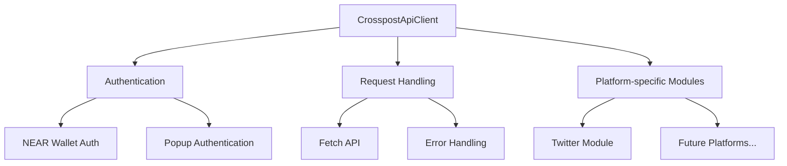

# Crosspost SDK Development

## Overview

The Crosspost SDK is a TypeScript library that provides a simple and intuitive way for client applications to interact with the Crosspost API. It abstracts away the complexities of API communication, authentication, and error handling, allowing developers to easily integrate social media functionality into their applications.

## Architecture

The SDK follows a modular architecture with the following components:



### Core Components

1. **CrosspostApiClient**: The main entry point for the SDK, providing methods for all API operations
2. **Authentication**: Handles NEAR wallet signature authentication and popup-based OAuth flow
3. **Request Handling**: Manages API requests, responses, and error handling
4. **Platform-specific Modules**: Specialized modules for each supported platform

## Directory Structure

```
sdk/
├── README.md                 # SDK documentation
├── package.json              # NPM package configuration
├── tsconfig.json             # TypeScript configuration
├── jsr.json                  # JSR (Deno) package configuration
├── .gitignore                # Git ignore file
├── mod.ts                    # Deno entry point
├── src/
│   ├── index.ts              # Main entry point
│   ├── client.ts             # API client implementation
│   ├── auth.ts               # Authentication utilities
│   ├── config.ts             # SDK configuration
│   ├── platforms/            # Platform-specific modules
│   │   ├── index.ts          # Platform exports
│   │   └── twitter.ts        # Twitter-specific functionality
│   └── types/                # TypeScript type definitions
│       ├── index.ts          # Type exports
│       └── api-types.ts      # API request/response types
└── examples/                 # Example usage
    └── basic-usage.ts        # Basic usage example
```

## Implementation Approach

1. **Type Generation**: Generate TypeScript types from the OpenAPI specification
2. **Core Client**: Implement the CrosspostApiClient class with methods for all API operations
3. **Authentication**: 
   - Implement NEAR wallet signature authentication
   - Provide popup-based OAuth flow for better user experience
4. **Platform Support**: Create platform-specific modules for Twitter and other platforms
5. **Error Handling**: Implement robust error handling and clear error messages
6. **Documentation**: Provide comprehensive documentation and examples

## Publishing Strategy

1. **NPM Package**: Publish to NPM for Node.js and browser environments
2. **JSR Package**: Publish to JSR for Deno environments
3. **Versioning**: Follow semantic versioning (SemVer) for releases

## Progress

### Completed

- ✅ Created SDK directory structure
- ✅ Created SDK README.md with documentation
- ✅ Created memory bank entry for SDK development
- ✅ Defined TypeScript types for the SDK
- ✅ Implemented the CrosspostApiClient class
- ✅ Added popup-based authentication flow
- ✅ Created example usage code
- ✅ Set up package.json and tsconfig.json
- ✅ Created JSR configuration for Deno

### In Progress

- 🔄 Refining the SDK implementation

### Planned

- ⬜ Generate TypeScript types from OpenAPI specification
- ⬜ Implement platform-specific modules
- ⬜ Set up build and publishing configuration
- ⬜ Write comprehensive documentation

## Next Steps

1. Enhance the core SDK files:
   - Improve error handling and response processing
   - Add more comprehensive documentation
   - Implement additional API methods

2. Generate TypeScript types from OpenAPI specification:
   - Set up a build script to generate types
   - Integrate generated types with existing types

3. Create platform-specific modules:
   - Twitter module with specialized functionality
   - Prepare for additional platforms

4. Set up build and publishing configuration:
   - Configure TypeScript compilation
   - Set up NPM package
   - Configure JSR package

5. Create more example applications:
   - Node.js example
   - Browser example with popup authentication

## Authentication Approaches

The SDK supports two authentication approaches:

1. **Traditional Redirect**: Redirects the user to the platform's OAuth page and then back to the application
   - Simple to implement
   - Works in all environments
   - Disrupts user experience by navigating away from the application

2. **Popup Authentication** (Recommended): Opens a popup window for authentication
   - Keeps users on the application page
   - Provides a better user experience
   - Allows for custom handling of authentication completion
   - Works across all modern browsers

The popup approach is implemented as follows:

```typescript
await client.connectPlatformAccount(
  SupportedPlatform.TWITTER,
  'https://your-app.com/callback',
  {
    usePopup: true, // Use a popup window instead of redirecting
    popupFeatures: 'width=600,height=700,left=0,top=0', // Customize popup size
    onComplete: (result) => {
      if (result.success) {
        console.log('Authentication completed successfully!');
        // Fetch accounts or perform other actions
      } else {
        console.error('Authentication failed:', result.error);
      }
    }
  }
);
