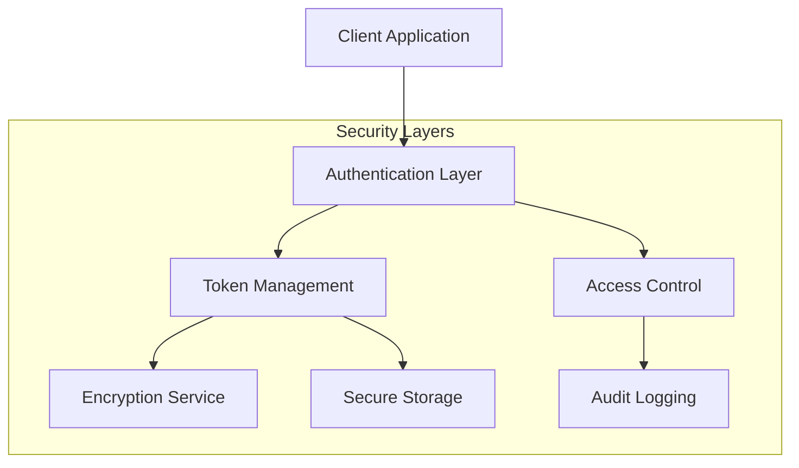
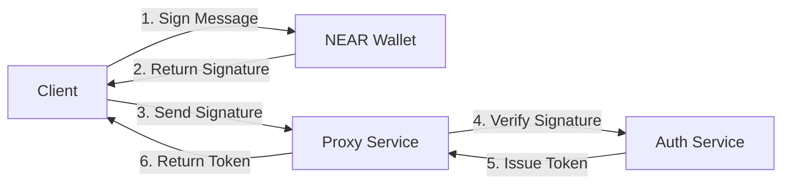
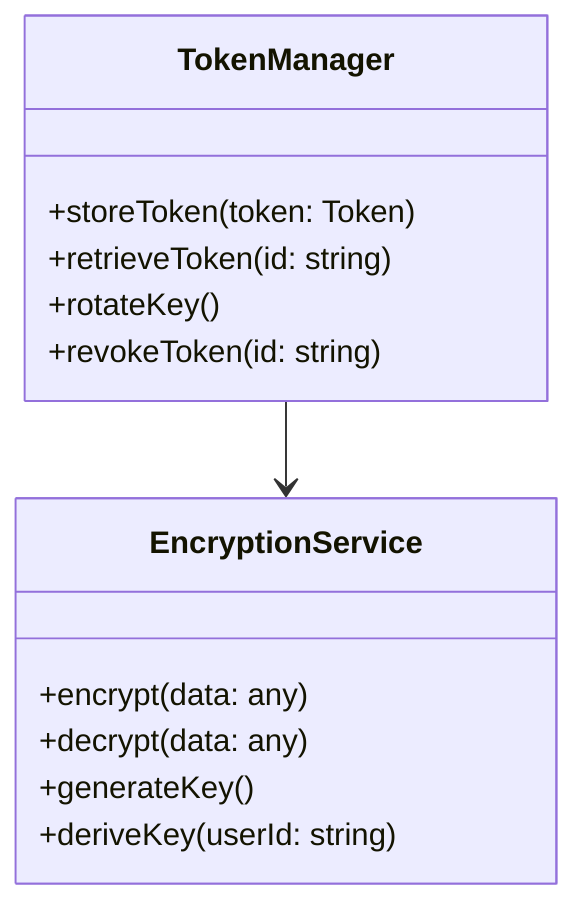
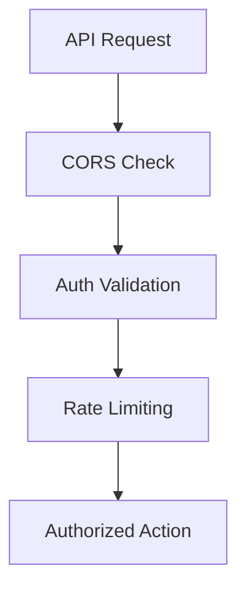

# Open Crosspost Proxy Service: Security Plan

## Overview

The security architecture of the Open Crosspost Proxy Service is designed to protect sensitive user
data, particularly OAuth tokens, while providing secure and reliable access to social media
platforms.

## Core Security Components

### 1. Authentication System

**Implementation:**

- NEAR wallet signature-based authentication
- API key validation for applications
- OAuth token management for platforms
- Signature verification and validation

### 2. Token Security

**Features:**

- AES-GCM encryption
- Key versioning support
- Secure key storage
- Token lifecycle management

### 3. Access Control

**Implementation:**

- CORS restrictions
- Origin validation
- Rate limiting
- Permission checks

## Implementation Phases

### Phase 1: Foundation Security ✅

1. **Token Encryption**
   - Implemented AES-GCM encryption
   - Added key versioning support
   - Established secure key management

2. **Access Control**
   - NEAR wallet integration
   - API key validation
   - CORS configuration

3. **Audit Logging**
   - PII redaction
   - Operation logging
   - Access tracking

### Phase 2: Enhanced Security 🔄

1. **Token Management**
   - Metadata separation
   - Expiry tracking
   - Access patterns monitoring

2. **Key Management**
   - Automatic key rotation
   - User-specific key derivation
   - Key backup procedures

3. **Monitoring**
   - Anomaly detection
   - Alert system
   - Security metrics

### Phase 3: Advanced Features 📋

1. **Zero-Trust Architecture**
   - Request-level verification
   - Context-based access
   - Continuous validation

2. **Threat Prevention**
   - Rate limit optimization
   - DDoS protection
   - Abuse prevention

3. **Compliance**
   - Audit improvements
   - Policy enforcement
   - Compliance reporting

## Security Measures

### 1. Data Protection

- Encryption at rest and in transit
- Secure key management
- Data minimization
- Regular security audits

### 2. Access Security

- Multi-factor authentication
- Strict CORS policies
- Token validation
- Rate limiting

### 3. Monitoring

- Real-time alerts
- Access logging
- Error tracking
- Performance monitoring

### 4. Incident Response

- Alert procedures
- Response playbooks
- Recovery plans
- Stakeholder communication

## Best Practices

1. **Encryption**
   - Use strong algorithms (AES-GCM)
   - Implement proper key sizes
   - Secure IV generation
   - Regular key rotation

2. **Authentication**
   - Validate all requests
   - Verify signatures
   - Check permissions
   - Monitor access patterns

3. **Development**
   - Input validation
   - Error handling
   - Dependency management
   - Code review

4. **Operations**
   - Regular updates
   - Security patches
   - Configuration management
   - Access control
