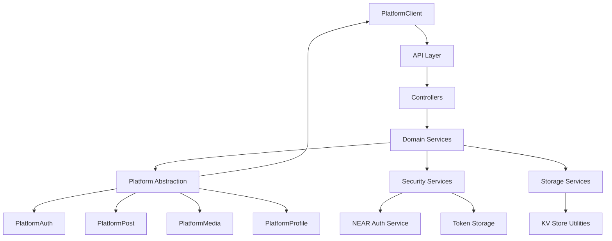
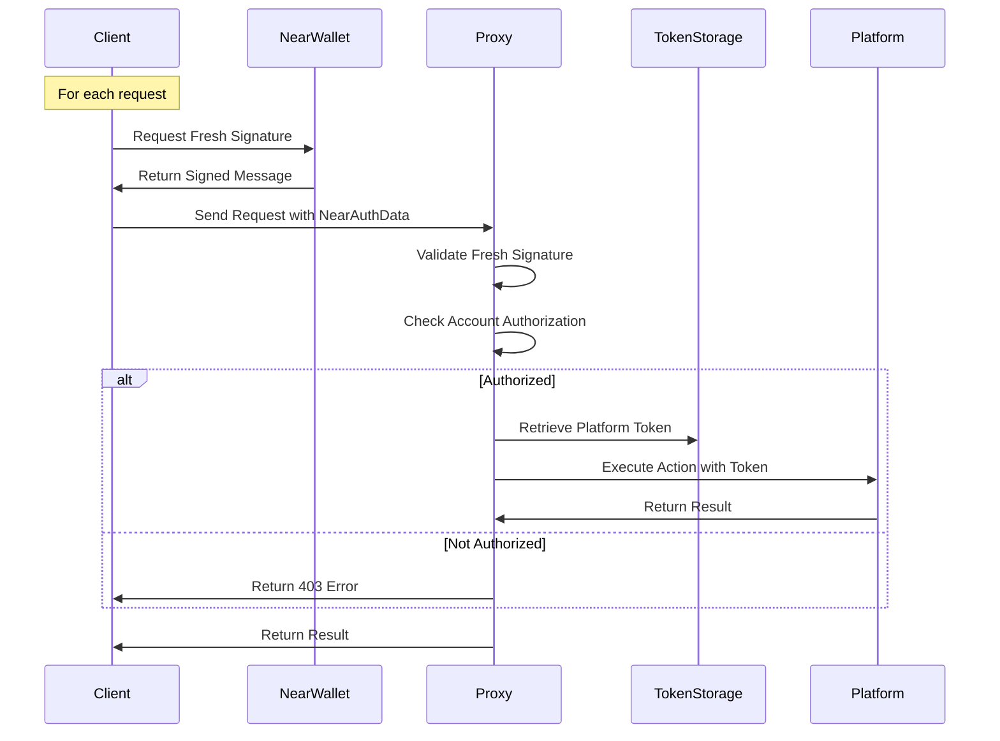
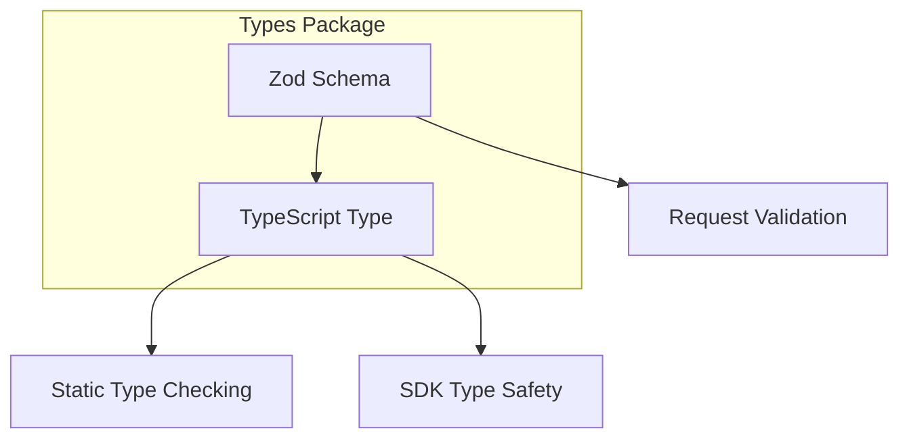
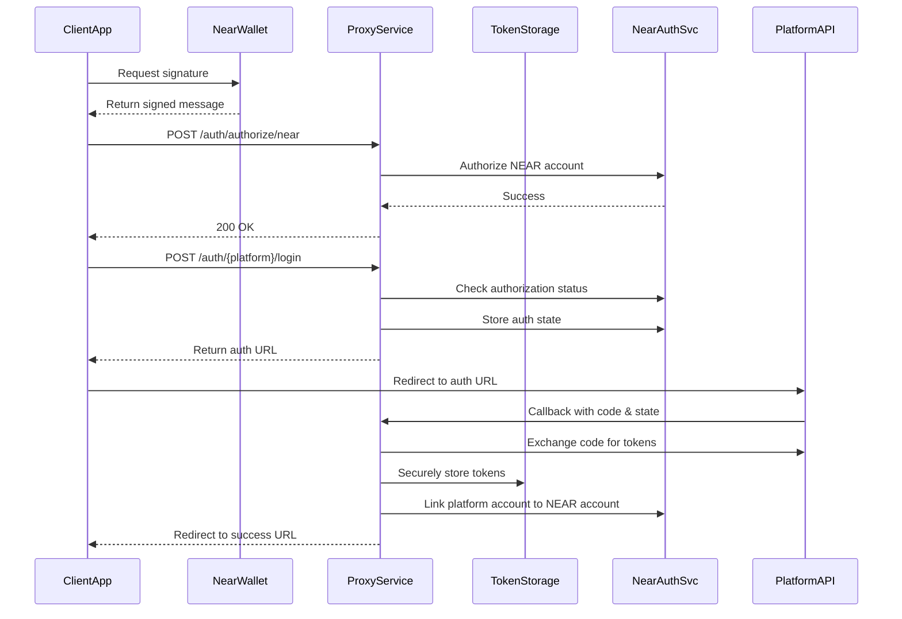
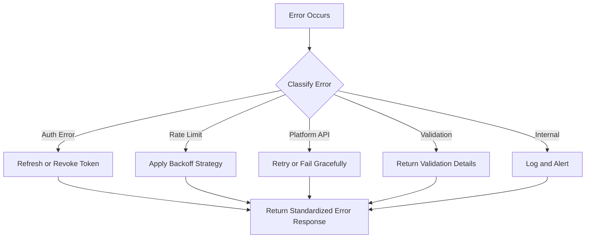

# Social Media API Proxy System Patterns

## Core Architecture

The Open Crosspost Proxy Service uses a layered architecture with clear separation of concerns,
enabling platform-agnostic design and extensibility.

## Key Design Patterns

### 1. Platform Abstraction Pattern

The platform abstraction layer separates core proxy functionality from platform-specific
implementations, allowing easy extension to other social media platforms.

Each platform interface has a specific responsibility:

- **PlatformAuth**: Handles authentication flows
- **PlatformClient**: Manages API client instances
- **PlatformPost**: Handles post creation and management
- **PlatformMedia**: Manages media uploads and attachments
- **PlatformProfile**: Manages user profile operations

### 2. NEAR-Centric Authentication Pattern

The system uses NEAR wallet signatures for authentication, providing a secure way to authorize
actions without exposing OAuth tokens to clients.

Benefits:

- Enhanced security through per-request signatures
- No persistent authentication state in browser
- Multiple platform accounts linked to a single NEAR wallet
- Cross-platform actions authorized by unique signatures
- Decentralized identity management
- Reduced attack surface by eliminating cookie-based vulnerabilities

### 3. Token Management Pattern

The system implements a centralized token management approach where platform tokens are stored
securely and accessed via a central `NearAuthService`.

Key components:

- **NearAuthService**: Central coordinator for token operations
- **TokenStorage**: Securely stores encrypted platform tokens
- **NearAuthService**: Manages NEAR account authorization and platform account linking

### 4. Centralized Schema and Type Pattern

The system uses a single source of truth for both TypeScript types and Zod schemas, with TypeScript
types derived from Zod schemas.

Benefits:

- Consistency between validation and type checking
- Reduced maintenance overhead
- Improved developer experience
- Better type safety across the codebase

### 5. Base Platform Classes Pattern

Base platform classes provide common functionality for platform-specific implementations, reducing
code duplication and ensuring consistent behavior.

Components:

- **BasePlatformClient**: Base implementation of PlatformClient interface
- **BasePlatformAuth**: Base implementation of PlatformAuth interface
- **Common error handling**: Standardized error handling for all platform operations

### 6. KV Utility Pattern

Standardized interfaces for interacting with Deno KV, with error handling, prefixed keys, and
transaction support.

Components:

- **KvStore**: Static utility class for direct KV operations
- **PrefixedKvStore**: Instance-based utility for working with prefixed keys

## Authentication Flow

## Error Handling Pattern

The system uses a standardized error handling approach with consistent error types, status codes,
and response formats.

Key components:

- **ApiError**: For application-level errors with code, status, details, and recoverable flag
- **PlatformError**: For platform-specific errors with original error details
- **Standardized status codes**: Consistent mapping from error codes to HTTP status codes
- **Detailed error responses**: Rich error details for better client feedback
