# Social Media API Proxy System Patterns

## System Architecture

The Social Media API Proxy follows a serverless architecture pattern using Deno Deploy as the compute platform. This architecture provides global distribution, high availability, and automatic scaling without managing traditional server infrastructure. The system is designed to be platform-agnostic, with Twitter as the initial implementation.

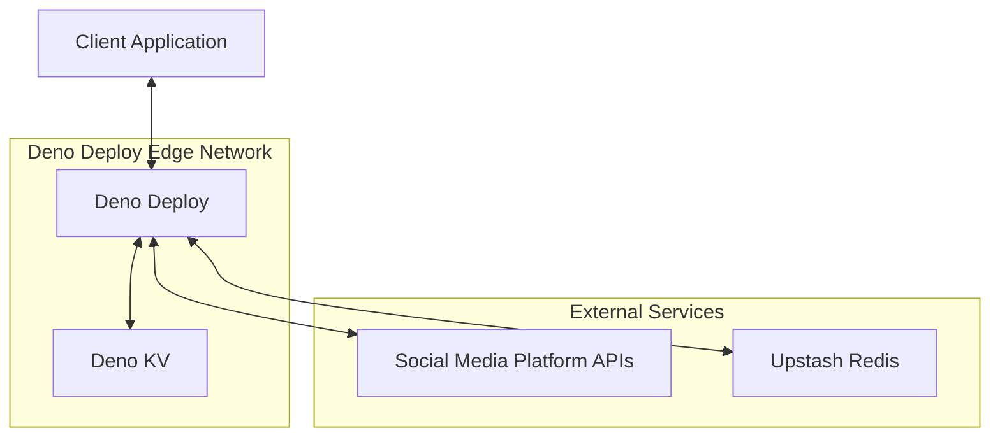

## Core Design Patterns

### 1. Platform Abstraction Pattern

The system implements a platform abstraction layer that separates the core proxy functionality from platform-specific implementations. This allows for easy extension to other social media platforms.

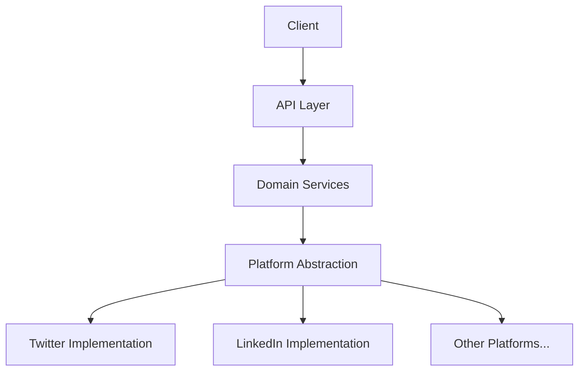

### 2. API Gateway Pattern

The Worker acts as an API Gateway, providing a unified interface to various social media APIs while handling cross-cutting concerns like authentication, rate limiting, and logging.

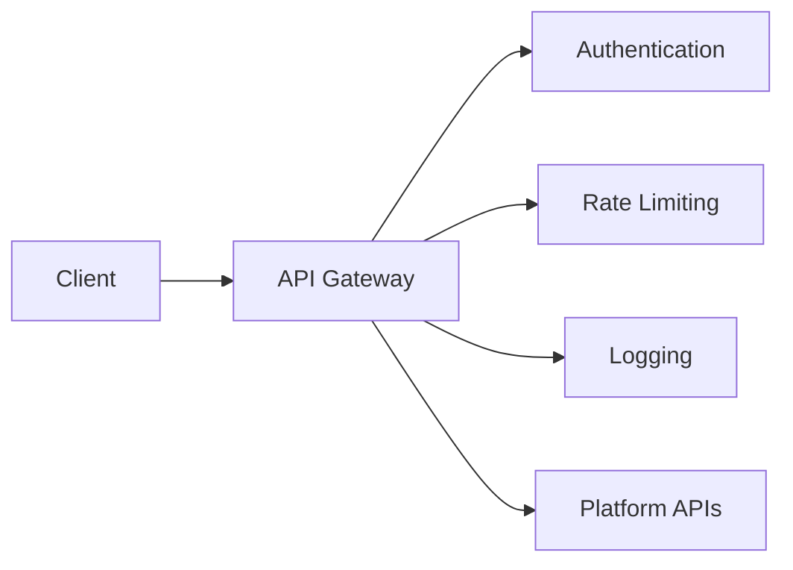

### 3. Authentication Patterns

#### 3.1 Platform-Specific OAuth Proxy Pattern

The system implements a platform-specific OAuth Proxy pattern, handling the complete OAuth flow with social media platforms through platform-specific routes while providing a simplified authentication interface to clients.

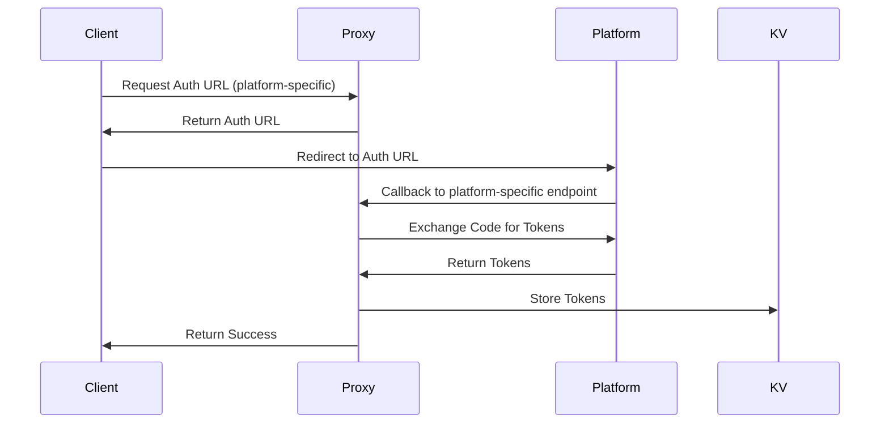

The platform-specific routes follow this pattern:
- `/auth/{platform}/login` - Initialize authentication for a specific platform
- `/auth/{platform}/callback` - Handle callback from a specific platform
- `/auth/{platform}/refresh` - Refresh tokens for a specific platform
- `/auth/{platform}/revoke` - Revoke tokens for a specific platform
- `/auth/{platform}/status` - Check token status for a specific platform

This approach:
- Makes the platform explicit in the URL
- Allows for platform-specific implementations
- Maintains a consistent pattern
- Simplifies routing logic
- Makes it easier to add new platforms

#### 3.2 NEAR Wallet Signature Authentication Pattern

The system supports authentication using NEAR wallet signatures, allowing users to authenticate and authorize actions using their NEAR wallet.

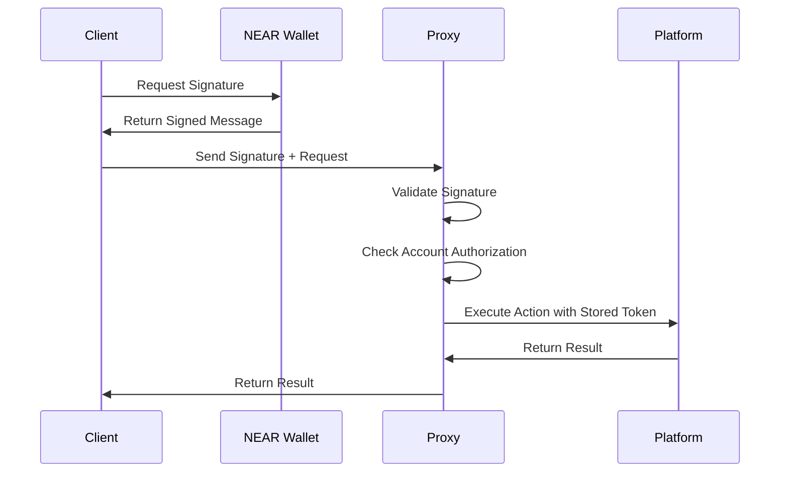

This pattern enables:
- Secure authentication without exposing OAuth tokens to the client
- Multiple platform accounts linked to a single NEAR wallet
- Cross-platform actions authorized by a single signature
- Decentralized identity management

### 4. API Key Management Pattern

A dedicated API Key Management system handles the creation, validation, rotation, and revocation of API keys for client applications.

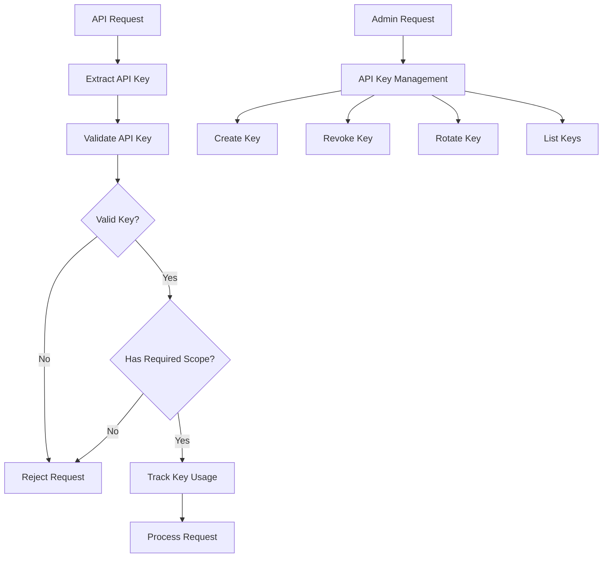

### 5. Circuit Breaker Pattern

To handle potential API outages or rate limiting, the system implements a Circuit Breaker pattern to prevent cascading failures.

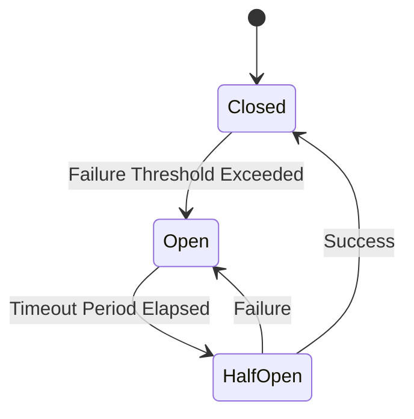

### 6. Token Manager Pattern

A dedicated Token Manager handles secure storage, retrieval, and refresh of OAuth tokens.

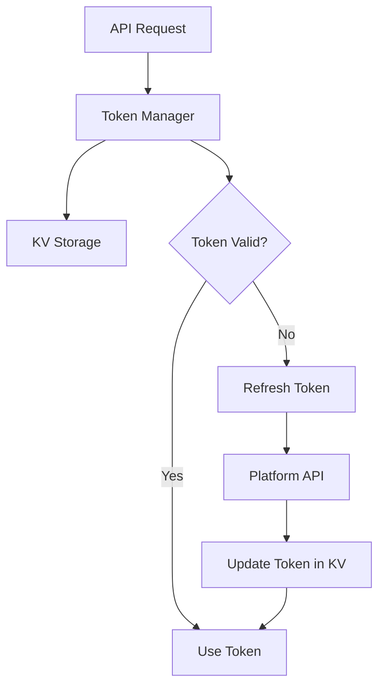

### 7. Multi-level Rate Limit Pattern

A comprehensive Rate Limit Manager tracks and enforces rate limits at multiple levels: platform API limits, global service limits, per-API key limits, and per-user limits.

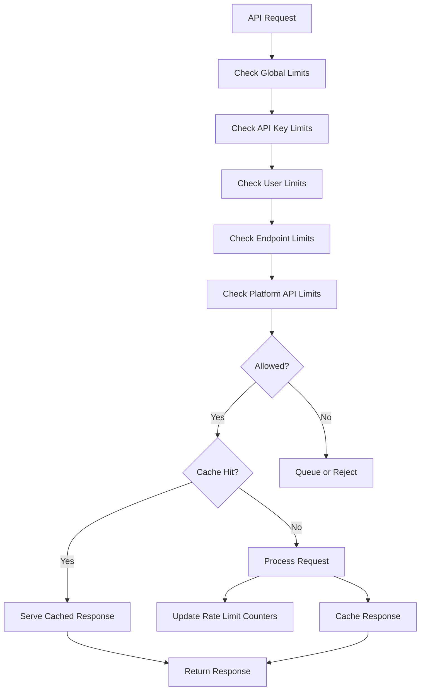

### 8. Cache-Aside Pattern

The system implements a Cache-Aside pattern using Redis for caching API responses, reducing duplicate API calls and improving performance.

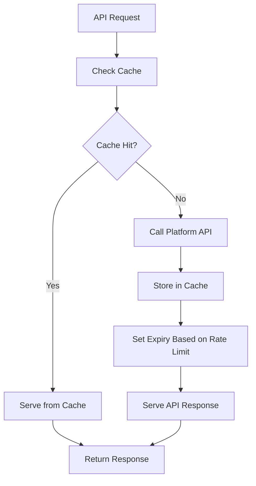

### 9. OpenAPI Documentation Pattern

The system generates and serves OpenAPI documentation for all endpoints, providing a self-documenting API.

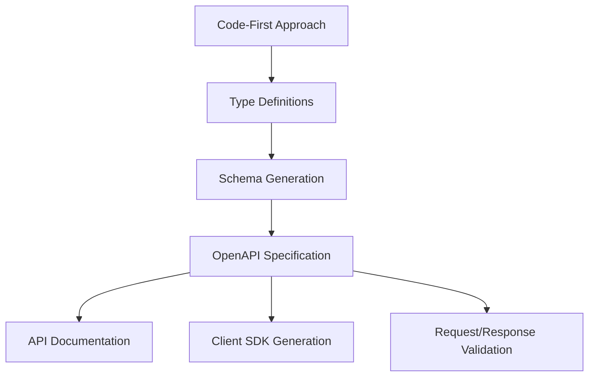

## Component Relationships

### Core Components

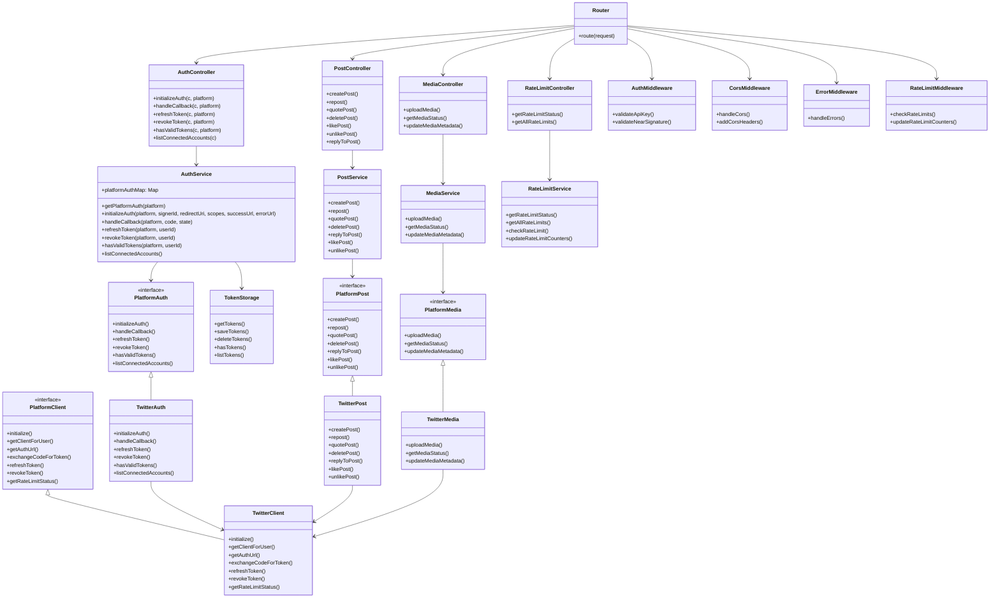

## Data Flow Patterns

### Authentication Flow

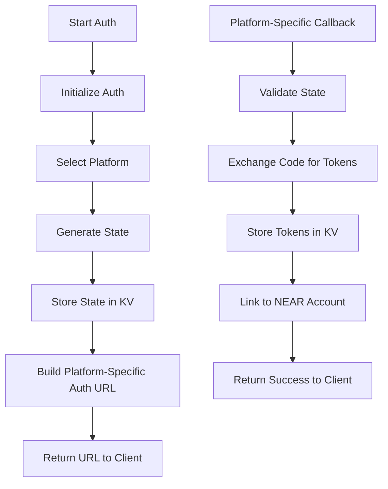

### Post Creation Flow

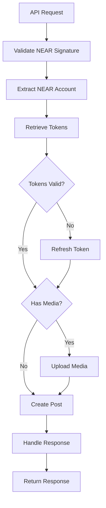

### Thread Creation Flow

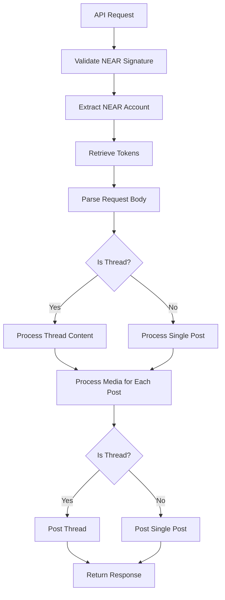

### Media Upload Flow

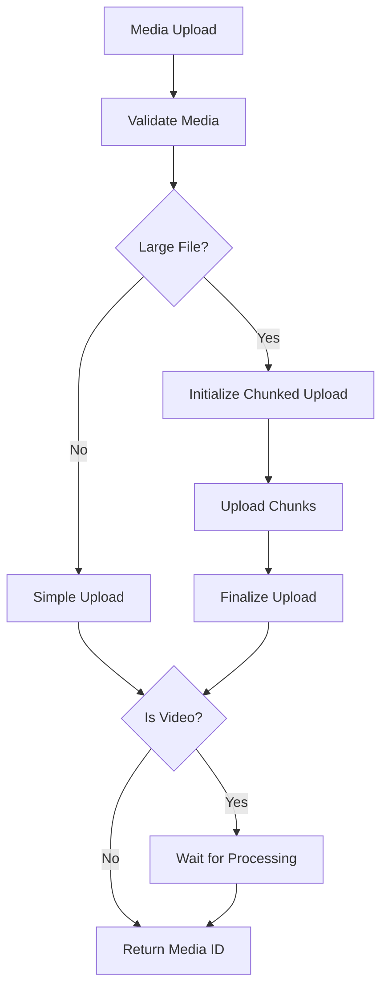

## Error Handling Patterns

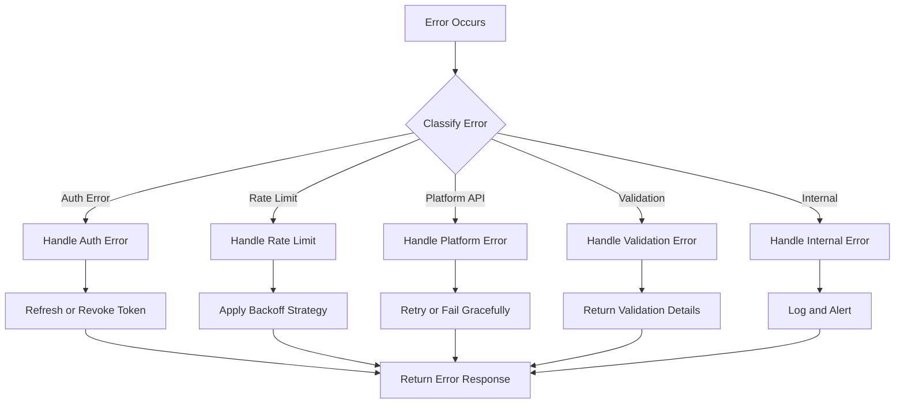

## Deployment Patterns

```mermaid
flowchart TD
    Code[Code Changes] --> CI[CI Pipeline]
    CI --> Lint[Lint and Format]
    Lint --> Tests[Run Tests]
    Tests --> Build[Build]
    Build --> DeployStaging[Deploy to Staging]
    DeployStaging --> StagingTests[Run Staging Tests]
    StagingTests --> DeployProd[Deploy to Production]
