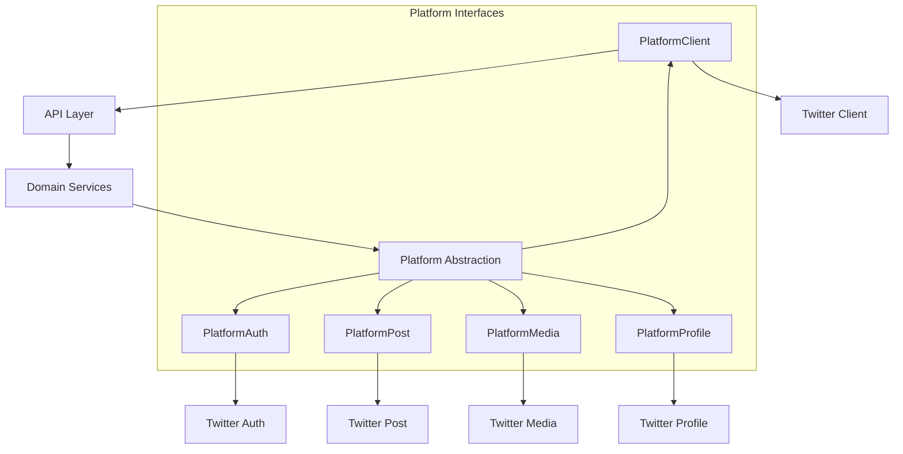
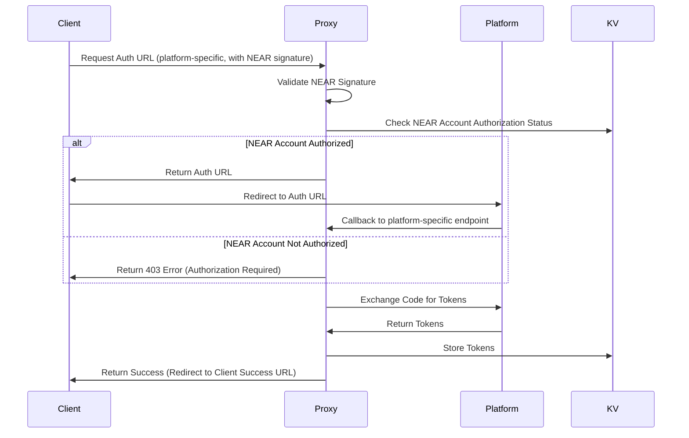
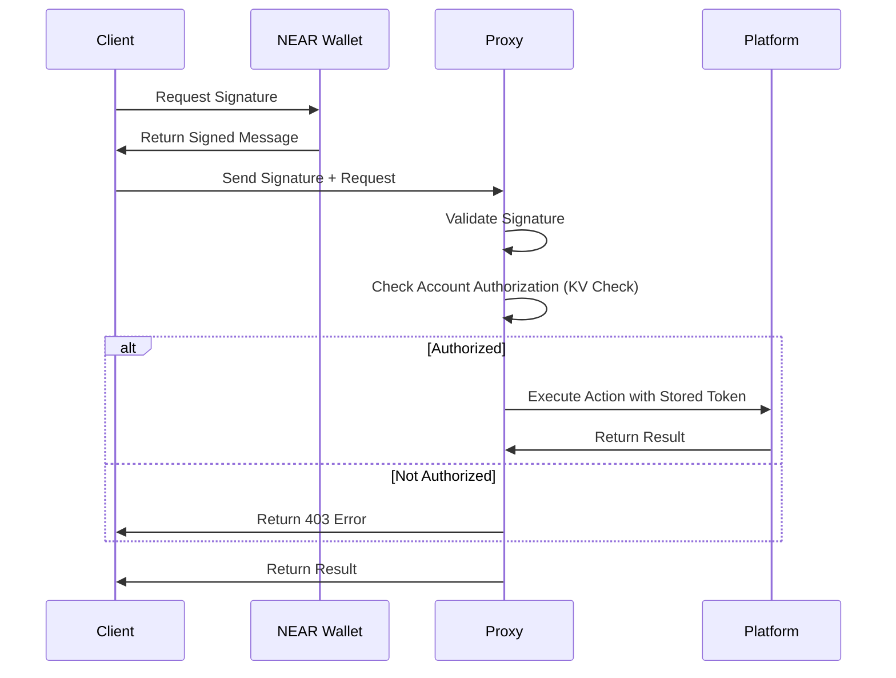
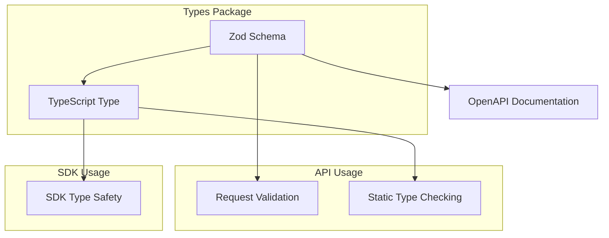
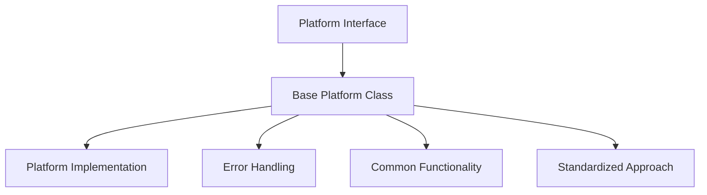
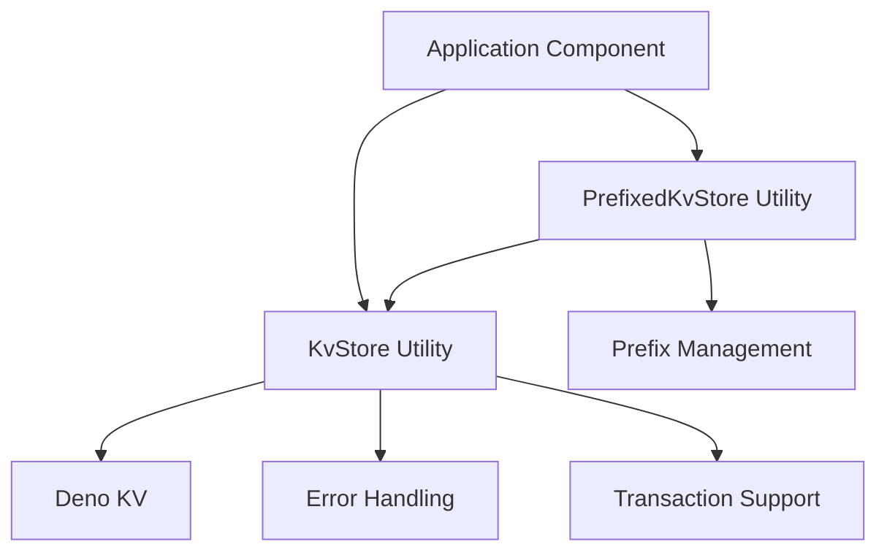
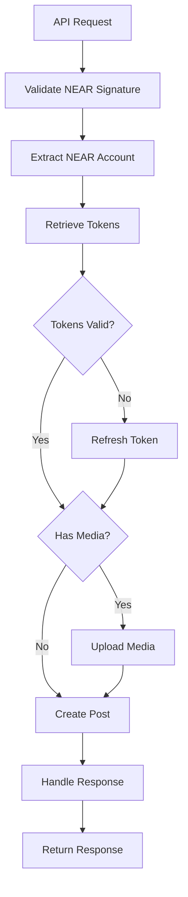

# Social Media API Proxy System Patterns

## Core Design Patterns

### 1. Platform Abstraction Pattern

The system implements a platform abstraction layer that separates the core proxy functionality from
platform-specific implementations. This allows for easy extension to other social media platforms.



Each platform interface has a specific responsibility:

- **PlatformAuth**: Handles authentication flows
- **PlatformClient**: Manages API client instances
- **PlatformPost**: Handles post creation and management
- **PlatformMedia**: Manages media uploads and attachments
- **PlatformProfile**: Manages user profile operations

### 2. Authentication Patterns

#### 2.1 Platform-Specific OAuth Proxy Pattern

The system implements a platform-specific OAuth Proxy pattern, handling the complete OAuth flow with
social media platforms through platform-specific routes while providing a simplified authentication
interface to clients.



The platform-specific routes follow this pattern:

- `/auth/{platform}/login` - Initialize authentication for a specific platform
- `/auth/{platform}/callback` - Handle callback from a specific platform
- `/auth/{platform}/refresh` - Refresh tokens for a specific platform
- `/auth/{platform}/revoke` - Revoke tokens for a specific platform
- `/auth/{platform}/status` - Check token status for a specific platform

#### 2.2 NEAR Wallet Signature Authentication Pattern

The system supports authentication using NEAR wallet signatures, allowing users to authenticate and
authorize actions using their NEAR wallet.



This pattern enables:

- Secure authentication without exposing OAuth tokens to the client
- Multiple platform accounts linked to a single NEAR wallet
- Cross-platform actions authorized by a single signature
- Decentralized identity management

### 3. Centralized Schema and Type Pattern

The system implements a Centralized Schema and Type pattern that provides a single source of truth for both TypeScript types and Zod schemas. TypeScript types are derived from Zod schemas using `z.infer<typeof schemaName>`, ensuring consistency between validation and type checking.



This pattern ensures:
- Single source of truth for data models
- Consistency between validation and type checking
- Reduced maintenance overhead
- Improved developer experience
- Better type safety across the codebase

### 4. Base Platform Classes Pattern

The system implements a Base Platform Classes pattern that provides common functionality for
platform-specific implementations.



The Base Platform Classes pattern includes:

- **BasePlatformClient**: Base implementation of PlatformClient interface
- **BasePlatformAuth**: Base implementation of PlatformAuth interface
- **Common error handling**: Standardized error handling for all platform operations
- **Common functionality**: Shared functionality across platform implementations

This pattern ensures:

- Reduced code duplication
- Consistent error handling
- Standardized approach to platform operations
- Easier implementation of new platforms
- Improved maintainability

### 5. KV Utility Pattern

The system implements a KV Utility pattern that provides a standardized interface for interacting
with Deno KV, with error handling, prefixed keys, and other utilities.



The KV Utility pattern includes:

- **KvStore**: Static utility class for direct KV operations
- **PrefixedKvStore**: Instance-based utility for working with prefixed keys
- **Error handling**: Standardized error handling for all KV operations
- **Transaction support**: Simplified transaction handling

## Data Flow Patterns

### NEAR Account Authorization Flow

```mermaid
flowchart TD
    subgraph Authorize
        ReqAuth[POST /auth/authorize/near Request] --> ExtractAuth[Extract NEAR Auth from Header]
        ExtractAuth --> ValidateSigAuth[Validate Signature]
        ValidateSigAuth --> StoreAuth[Store Authorization in KV]
        StoreAuth --> SuccessAuth[Return Success (200)]
        ValidateSigAuth -- Invalid --> ErrorAuth[Return Error (401)]
        StoreAuth -- Error --> ErrorAuth[Return Error (500)]
    end

    subgraph Unauthorize
        ReqUnauth[DELETE /auth/unauthorize/near Request] --> ExtractUnauth[Extract NEAR Auth from Header]
        ExtractUnauth --> ValidateSigUnauth[Validate Signature]
        ValidateSigUnauth --> DeleteAuth[Delete Authorization from KV]
        DeleteAuth --> SuccessUnauth[Return Success (200)]
        ValidateSigUnauth -- Invalid --> ErrorUnauth[Return Error (401)]
        DeleteAuth -- Error --> ErrorUnauth[Return Error (500)]
    end
    
    subgraph CheckStatus
        ReqStatus[GET /auth/authorize/near/status Request] --> ExtractStatus[Extract NEAR Auth from Header]
        ExtractStatus --> ValidateSigStatus[Validate Signature]
        ValidateSigStatus --> CheckKV[Check Authorization in KV]
        CheckKV --> ReturnStatus[Return Status (200)]
        ValidateSigStatus -- Invalid --> ErrorStatus[Return Error (401)]
        CheckKV -- Error --> ErrorStatus[Return Error (500)]
    end
```

### Post Creation Flow



## Error Handling Patterns

```mermaid
flowchart TD
    Error[Error Occurs] --> Classify{Classify Error}
    Classify -->|Auth Error| HandleAuth[Handle Auth Error]
    Classify -->|Rate Limit| HandleRate[Handle Rate Limit]
    Classify -->|Platform API| HandlePlatform[Handle Platform Error]
    Classify -->|Validation| HandleValidation[Handle Validation Error]
    Classify -->|Internal| HandleInternal[Handle Internal Error]
    
    HandleAuth --> RefreshOrRevoke[Refresh or Revoke Token]
    HandleRate --> Backoff[Apply Backoff Strategy]
    HandlePlatform --> RetryOrFail[Retry or Fail Gracefully]
    HandleValidation --> ReturnDetails[Return Validation Details]
    HandleInternal --> LogAndAlert[Log and Alert]
    
    RefreshOrRevoke --> ReturnError[Return Error Response]
    Backoff --> ReturnError
    RetryOrFail --> ReturnError
    ReturnDetails --> ReturnError
    LogAndAlert --> ReturnError
