# Social Media API Proxy System Patterns

## System Architecture

The Social Media API Proxy follows a serverless architecture pattern using Deno Deploy as the
compute platform. This architecture provides global distribution, high availability, and automatic
scaling without managing traditional server infrastructure. The system is designed to be
platform-agnostic, with Twitter as the initial implementation.

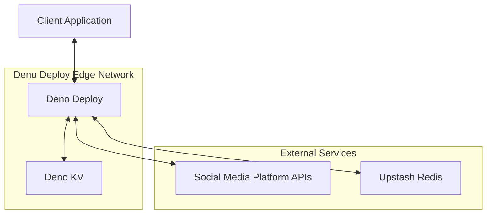

## Core Design Patterns

### 1. Platform Abstraction Pattern

The system implements a platform abstraction layer that separates the core proxy functionality from
platform-specific implementations. This allows for easy extension to other social media platforms.

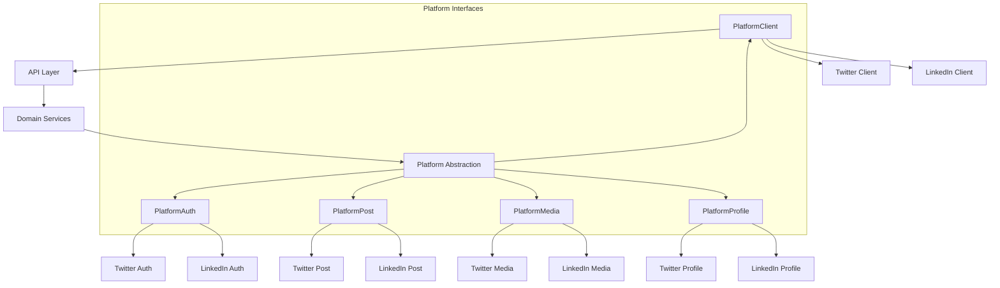

Each platform interface has a specific responsibility:

- **PlatformAuth**: Handles authentication flows
- **PlatformClient**: Manages API client instances
- **PlatformPost**: Handles post creation and management
- **PlatformMedia**: Manages media uploads and attachments
- **PlatformProfile**: Manages user profile operations

### 2. API Gateway Pattern

The Worker acts as an API Gateway, providing a unified interface to various social media APIs while
handling cross-cutting concerns like authentication, rate limiting, and logging.

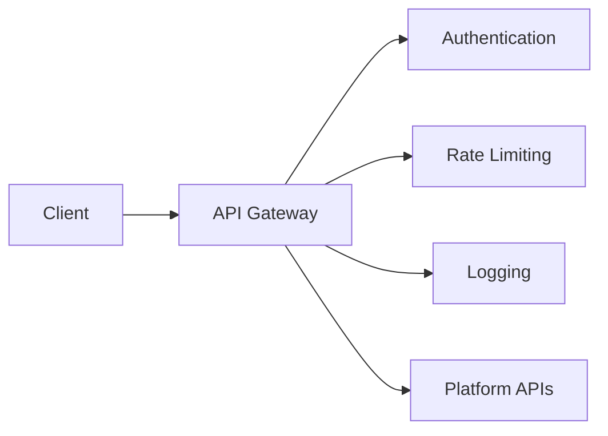

### 3. Authentication Patterns

#### 3.1 Platform-Specific OAuth Proxy Pattern

The system implements a platform-specific OAuth Proxy pattern, handling the complete OAuth flow with
social media platforms through platform-specific routes while providing a simplified authentication
interface to clients.

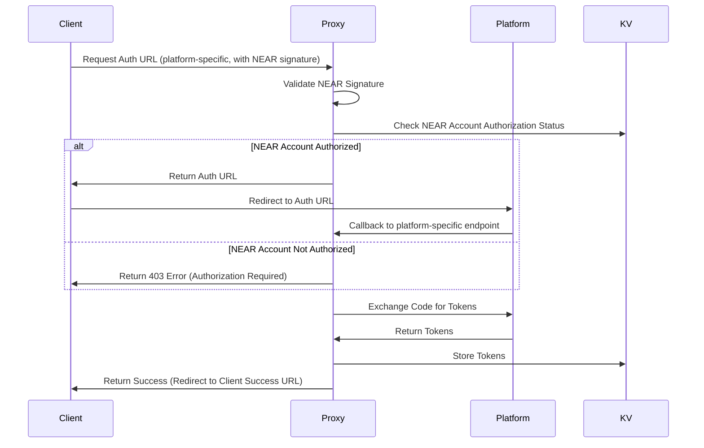

The platform-specific routes follow this pattern:

- `/auth/{platform}/login` - Initialize authentication for a specific platform
- `/auth/{platform}/callback` - Handle callback from a specific platform
- `/auth/{platform}/refresh` - Refresh tokens for a specific platform
- `/auth/{platform}/revoke` - Revoke tokens for a specific platform
- `/auth/{platform}/status` - Check token status for a specific platform

This approach:

- Makes the platform explicit in the URL
- Allows for platform-specific implementations
- Maintains a consistent pattern
- Simplifies routing logic
- Makes it easier to add new platforms

#### 3.2 NEAR Wallet Signature Authentication Pattern

The system supports authentication using NEAR wallet signatures, allowing users to authenticate and
authorize actions using their NEAR wallet.

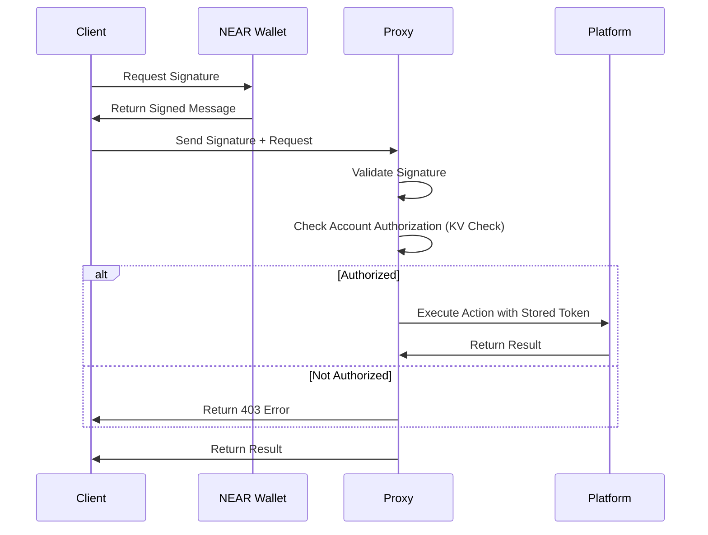

This pattern enables:

- Secure authentication without exposing OAuth tokens to the client
- Multiple platform accounts linked to a single NEAR wallet
- Cross-platform actions authorized by a single signature
- Decentralized identity management

### 4. API Key Management Pattern

A dedicated API Key Management system handles the creation, validation, rotation, and revocation of
API keys for client applications.

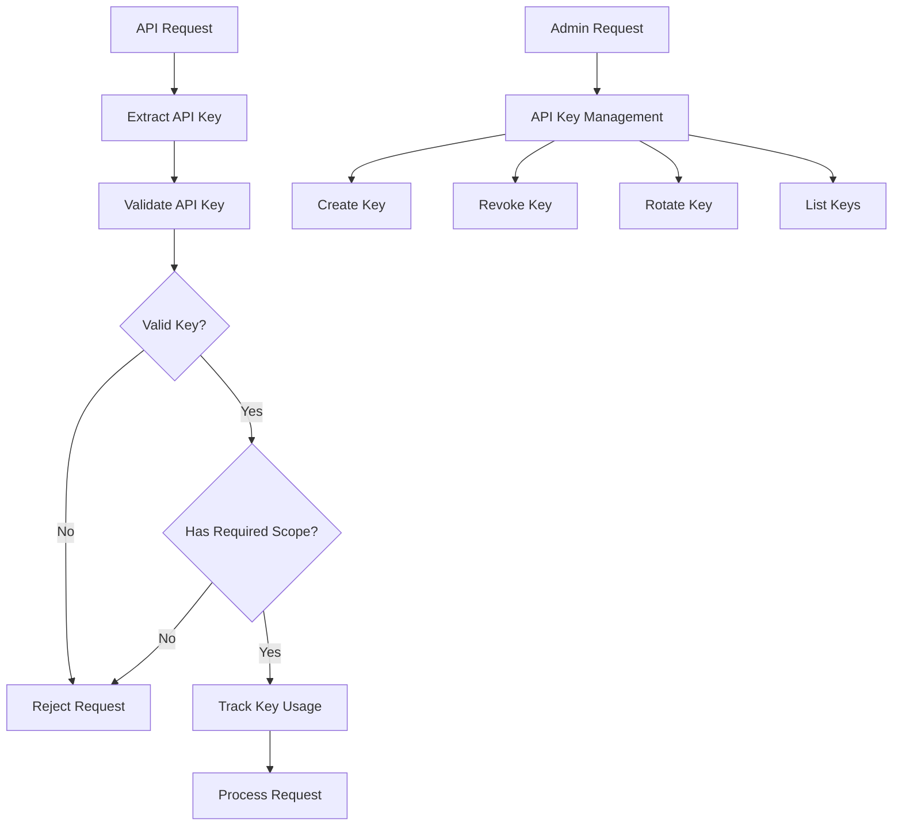

### 5. Circuit Breaker Pattern

To handle potential API outages or rate limiting, the system implements a Circuit Breaker pattern to
prevent cascading failures.

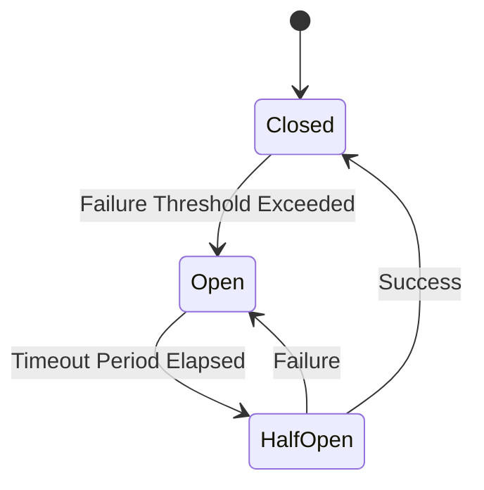

### 6. KV Utility Pattern

The system implements a KV Utility pattern that provides a standardized interface for interacting
with Deno KV, with error handling, prefixed keys, and other utilities.

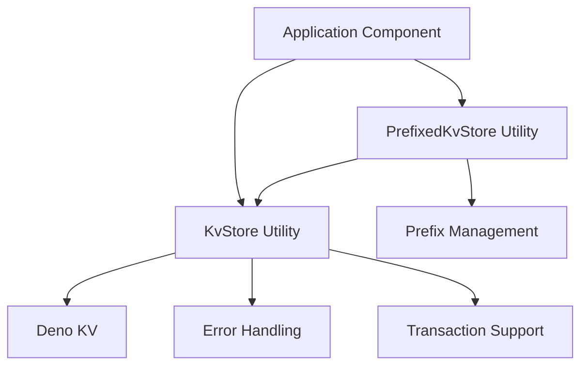

The KV Utility pattern includes:

- **KvStore**: Static utility class for direct KV operations
- **PrefixedKvStore**: Instance-based utility for working with prefixed keys
- **Error handling**: Standardized error handling for all KV operations
- **Transaction support**: Simplified transaction handling

This pattern ensures:

- Consistent error handling across all KV operations
- Simplified key management with prefixes
- Reduced code duplication
- Improved maintainability
- Standardized approach to KV access

### 7. Platform-Specific Token Manager Pattern

A dedicated Token Manager handles secure storage, retrieval, and refresh of OAuth tokens with
platform-specific separation.

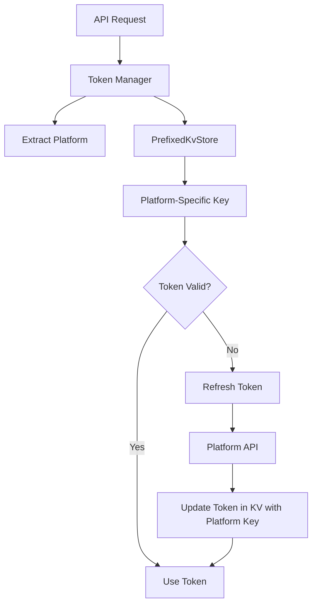

This pattern ensures:

- Clear separation of tokens by platform
- No cross-platform token conflicts
- Improved security through isolation
- Better organization of token storage
- Support for multiple platforms per user
- Standardized KV access through KvStore utilities

### 8. Base Platform Classes Pattern

The system implements a Base Platform Classes pattern that provides common functionality for
platform-specific implementations.

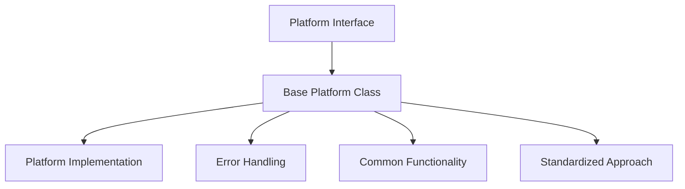

The Base Platform Classes pattern includes:

- **BasePlatformClient**: Base implementation of PlatformClient interface
- **BasePlatformAuth**: Base implementation of PlatformAuth interface
- **Common error handling**: Standardized error handling for all platform operations
- **Common functionality**: Shared functionality across platform implementations

This pattern ensures:

- Reduced code duplication
- Consistent error handling
- Standardized approach to platform operations
- Easier implementation of new platforms
- Improved maintainability

### 9. Multi-level Rate Limit Pattern

A comprehensive Rate Limit Manager tracks and enforces rate limits at multiple levels: platform API
limits, global service limits, per-API key limits, and per-user limits.

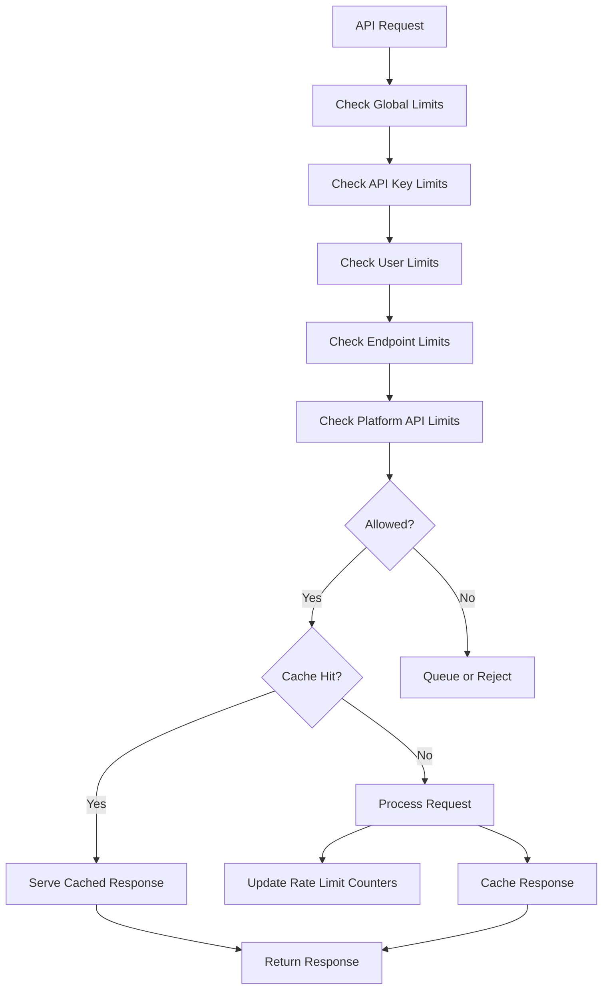

### 10. Cache-Aside Pattern

The system implements a Cache-Aside pattern using Redis for caching API responses, reducing
duplicate API calls and improving performance.

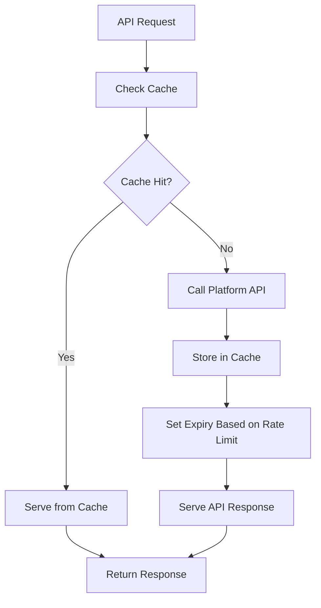

### 11. OpenAPI Documentation Pattern

The system generates and serves OpenAPI documentation for all endpoints, providing a
self-documenting API.

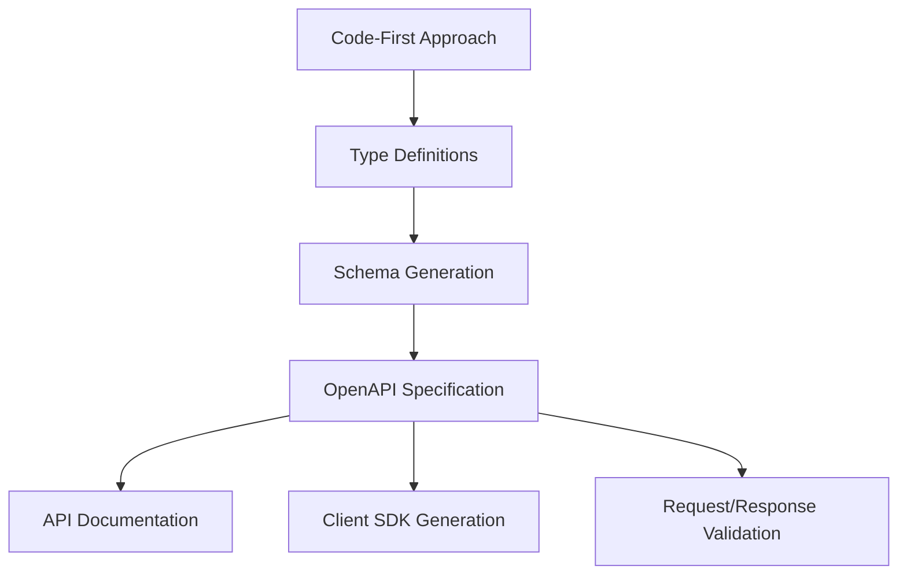

## Component Relationships

### Core Components

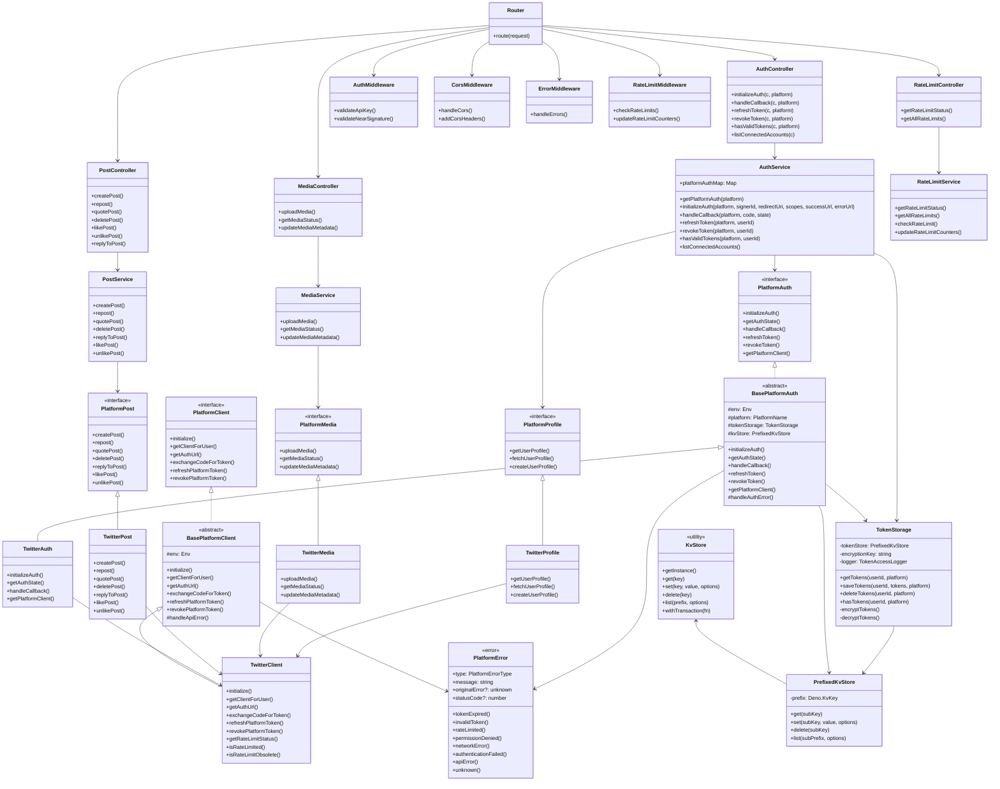

## Data Flow Patterns

### NEAR Account Authorization/Unauthorization Flow

```mermaid
flowchart TD
    subgraph Authorize
        ReqAuth[POST /auth/authorize/near Request] --> ExtractAuth[Extract NEAR Auth from Header]
        ExtractAuth --> ValidateSigAuth[Validate Signature]
        ValidateSigAuth --> StoreAuth[Store Authorization in KV]
        StoreAuth --> SuccessAuth[Return Success (200)]
        ValidateSigAuth -- Invalid --> ErrorAuth[Return Error (401)]
        StoreAuth -- Error --> ErrorAuth[Return Error (500)]
    end

    subgraph Unauthorize
        ReqUnauth[DELETE /auth/unauthorize/near Request] --> ExtractUnauth[Extract NEAR Auth from Header]
        ExtractUnauth --> ValidateSigUnauth[Validate Signature]
        ValidateSigUnauth --> DeleteAuth[Delete Authorization from KV]
        DeleteAuth --> SuccessUnauth[Return Success (200)]
        ValidateSigUnauth -- Invalid --> ErrorUnauth[Return Error (401)]
        DeleteAuth -- Error --> ErrorUnauth[Return Error (500)]
    end
    
    subgraph CheckStatus
        ReqStatus[GET /auth/authorize/near/status Request] --> ExtractStatus[Extract NEAR Auth from Header]
        ExtractStatus --> ValidateSigStatus[Validate Signature]
        ValidateSigStatus --> CheckKV[Check Authorization in KV]
        CheckKV --> ReturnStatus[Return Status (200)]
        ValidateSigStatus -- Invalid --> ErrorStatus[Return Error (401)]
        CheckKV -- Error --> ErrorStatus[Return Error (500)]
    end
```

### Platform Authentication Flow (Initiation)

```mermaid
flowchart TD
    Start[POST /auth/{platform}/login Request] --> ValidateNearSig[Validate NEAR Signature]
    ValidateNearSig --> CheckNearAuth{NEAR Account Authorized?}
    CheckNearAuth -- Yes --> SelectPlatform[Select Platform]
    CheckNearAuth -- No --> Return403[Return 403 Error]

    SelectPlatform --> GenerateState[Generate State]
    GenerateState --> StoreState[Store State in KV (with Success/Error URLs)]
    StoreState --> BuildURL[Build Platform-Specific Auth URL]
    BuildURL --> ReturnURL[Return Auth URL to Client]

    Callback[GET /auth/{platform}/callback] --> ValidateState[Validate State from KV]
    ValidateState --> ExchangeCode[Exchange Code for Tokens]
    ExchangeCode --> StoreTokens[Store Tokens in KV]
    StoreTokens --> LinkAccount[Link Platform Account to NEAR Account]
    LinkAccount --> RetrieveSuccessURL[Retrieve Success URL from State]
    RetrieveSuccessURL --> RedirectClient[Redirect Client to Success URL]
```

### Post Creation Flow

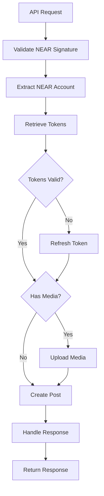

### Thread Creation Flow

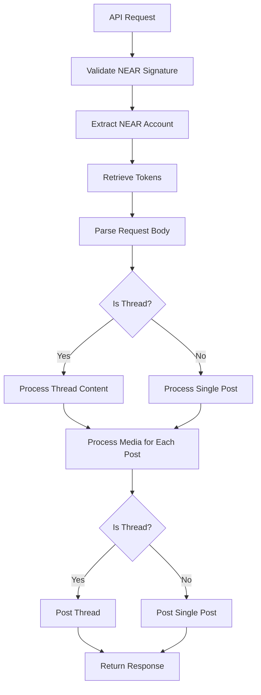

### Media Upload Flow

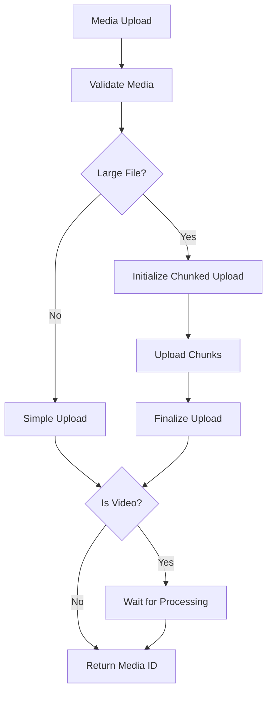

## Error Handling Patterns

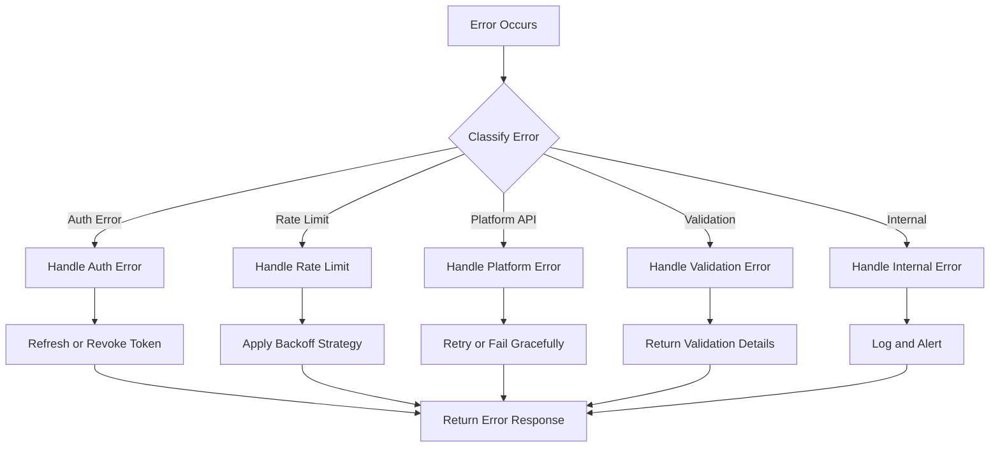

## Deployment Patterns

```mermaid
flowchart TD
    Code[Code Changes] --> CI[CI Pipeline]
    CI --> Lint[Lint and Format]
    Lint --> Tests[Run Tests]
    Tests --> Build[Build]
    Build --> DeployStaging[Deploy to Staging]
    DeployStaging --> StagingTests[Run Staging Tests]
    StagingTests --> DeployProd[Deploy to Production]
```
