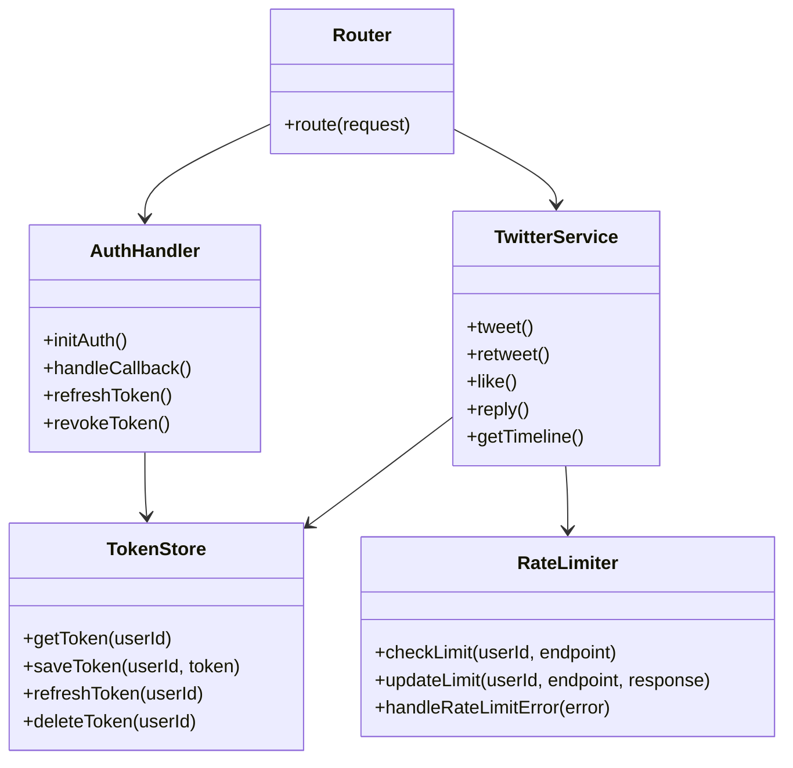
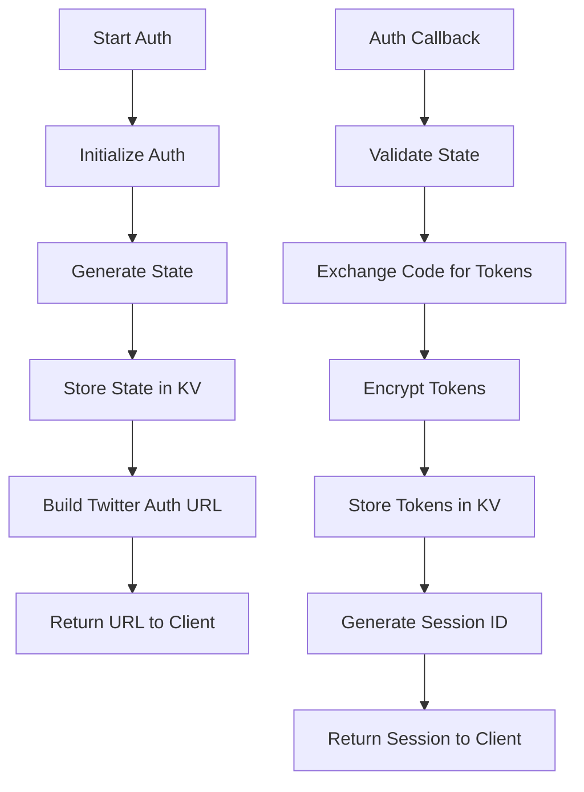
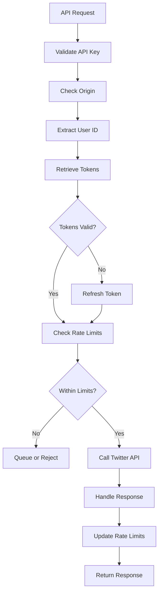
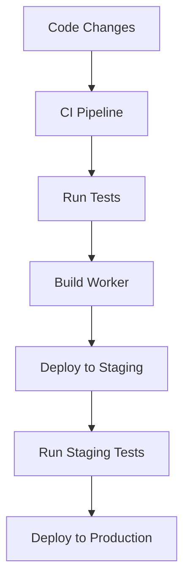

# Twitter API Proxy System Patterns

## System Architecture

The Twitter API Proxy follows a serverless architecture pattern using Cloudflare Workers as the compute platform. This architecture provides global distribution, high availability, and automatic scaling without managing traditional server infrastructure.

## Core Design Patterns

### 1. API Gateway Pattern

The Worker acts as an API Gateway, providing a unified interface to the Twitter API while handling cross-cutting concerns like authentication, rate limiting, and logging.

### 2. OAuth Proxy Pattern

The system implements an OAuth Proxy pattern, handling the complete OAuth flow with Twitter while providing a simplified authentication interface to clients.

### 3. Circuit Breaker Pattern

To handle potential Twitter API outages or rate limiting, the system implements a Circuit Breaker pattern to prevent cascading failures.

### 4. Token Manager Pattern

A dedicated Token Manager handles secure storage, retrieval, and refresh of OAuth tokens.

### 5. Rate Limit Manager Pattern

A Rate Limit Manager tracks and enforces both Twitter API rate limits and client-side rate limits.

## Component Relationships

### Core Components

## Data Flow Patterns

### Authentication Flow

### API Request Flow

## Error Handling Patterns

## Deployment Patterns

