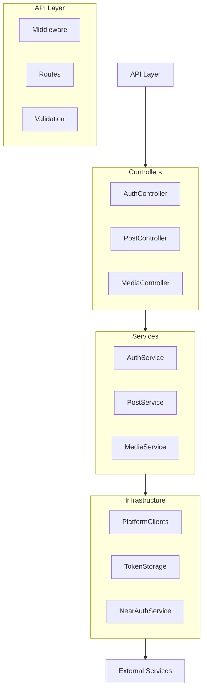

# Open Crosspost Proxy Service: Technical Context

## Technology Stack

### Core Infrastructure

| Component  | Technology            | Purpose                                              |
| ---------- | --------------------- | ---------------------------------------------------- |
| Runtime    | Deno                  | JavaScript/TypeScript runtime with built-in security |
| Deployment | Deno Deploy           | Edge runtime for global performance                  |
| Storage    | Deno KV               | Key-value storage for tokens and configuration       |
| Secrets    | Environment Variables | Secure storage for API credentials                   |

### Development Technologies

| Technology | Purpose                                               |
| ---------- | ----------------------------------------------------- |
| TypeScript | Type-safe development language                        |
| Deno       | Runtime, package manager, and development environment |
| Deno Test  | Built-in testing framework with BDD support           |
| Deno Lint  | Static code analysis                                  |
| Deno Fmt   | Code formatting                                       |

### Key Dependencies

| Dependency     | Purpose                                      |
| -------------- | -------------------------------------------- |
| Hono           | Fast, middleware-based HTTP framework        |
| twitter-api-v2 | Twitter API client with plugin support       |
| jose           | JWT handling and cryptographic operations    |
| zod            | Schema validation and type generation        |
| bs58           | Base58 encoding/decoding for NEAR signatures |
| @std/testing   | Testing utilities (BDD, assertions, mocks)   |

## Development Environment

```bash
# Start development server
deno task dev

# Run tests
deno task test

# Format and lint code
deno task fmt
deno task lint
```

### Environment Configuration

| Variable              | Purpose                                                |
| --------------------- | ------------------------------------------------------ |
| TWITTER_CLIENT_ID     | Twitter OAuth client ID                                |
| TWITTER_CLIENT_SECRET | Twitter OAuth client secret                            |
| ENCRYPTION_KEY        | Key for encrypting stored tokens                       |
| ALLOWED_ORIGINS       | Comma-separated list of allowed CORS origins           |
| ENVIRONMENT           | Current environment (development, staging, production) |

## Technical Architecture

### Layered Design



### Key Components

1. **API Layer**: Handles HTTP requests, middleware, and validation
2. **Controllers**: Coordinate service calls and format responses
3. **Services**: Implement business logic and orchestrate infrastructure
4. **Infrastructure**: Interact with external services and storage

## Security Implementation

### Token Security

- **Encryption**: AES-GCM encryption for tokens stored in Deno KV
- **Versioned Encryption**: Support for key rotation with version tracking
- **Access Logging**: Comprehensive logging with PII redaction
- **Zero Client Exposure**: Tokens never exposed to frontend code

### Authentication

- **NEAR Wallet Signatures**: Cryptographically secure authentication
- **CORS Protection**: Strict origin validation
- **Input Validation**: Zod schemas for all request validation

## Performance Optimizations

- **Edge Deployment**: Global distribution via Deno Deploy
- **Efficient KV Usage**: Minimized operations with batching
- **Rate Limiting**: Multi-level rate limiting with backoff strategies
- **Caching**: Strategic caching for improved performance

## Testing Strategy

- **BDD Approach**: Using `@std/testing/bdd` for describe/it style tests
- **Mocking**: Proper dependency mocking with `@std/testing/mock`
- **Edge Cases**: Comprehensive testing of error scenarios
- **Integration Tests**: Testing full request/response flows

## SDK Architecture

The SDK is divided into three packages:

1. **@crosspost/types**: Shared type definitions
   - Request/response types
   - Error types
   - Platform enums

2. **@crosspost/sdk**: Main client SDK
   - Platform-specific clients
   - Authentication providers
   - Type-safe request/response handling

## Technical Constraints

### Deno Deploy Limitations

- 10-minute HTTP request timeout
- 512MB memory limit per instance
- 128MB response size limit

### Deno KV Considerations

- Eventually consistent replication
- 4KB maximum key size, 64KB maximum value size
- 100MB storage limit on free tier

### Platform API Constraints

- Platform-specific rate limits
- Media upload size and format limitations
- OAuth token expiration and refresh requirements
