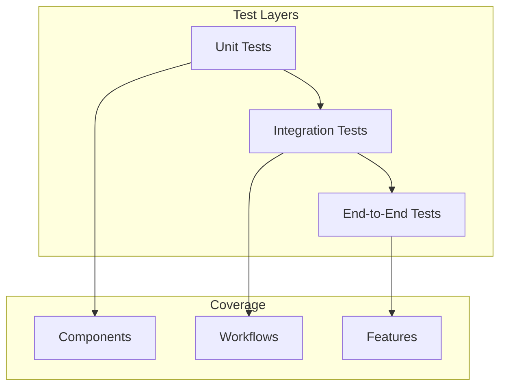
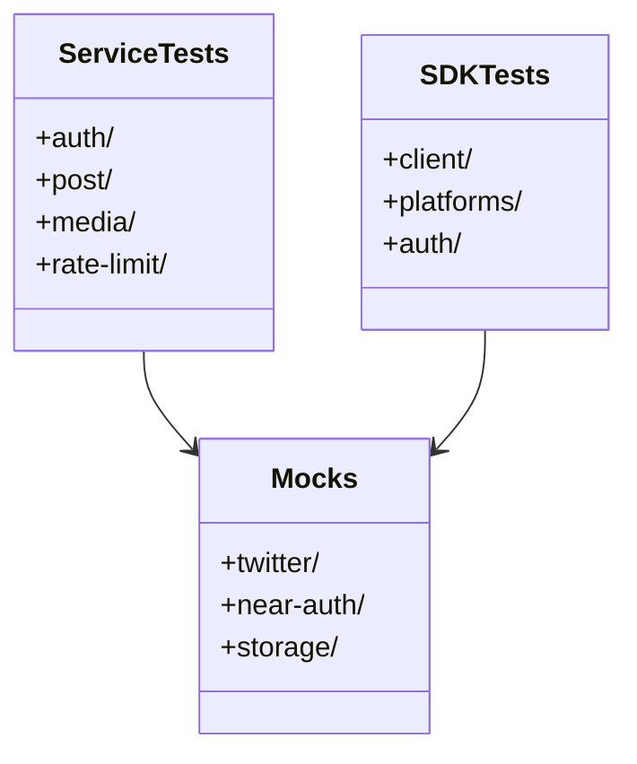
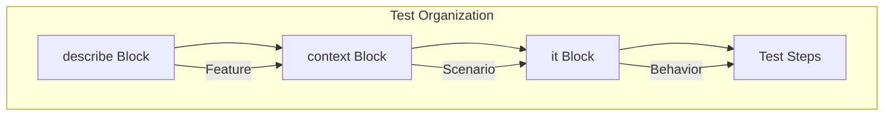

# Open Crosspost Proxy Service: Testing Strategy

## Overview

The testing strategy ensures reliability, correctness, and maintainability through comprehensive
testing at multiple levels. We use Behavior-Driven Development (BDD) with Deno's native testing
capabilities.



## Testing Architecture

### 1. Test Organization



### 2. BDD Structure



## Test Categories

### 1. Service Tests

**Location:** `tests/service/` **Purpose:** Test service endpoints against mocked dependencies

```typescript
describe('Post Creation', () => {
  context('with valid input', () => {
    it('creates a new post', async (t) => {
      await t.step('prepare test data', async () => {
        // Setup
      });

      await t.step('execute request', async () => {
        // Action
      });

      await t.step('verify response', async () => {
        // Assert
      });
    });
  });
});
```

### 2. SDK Tests

**Location:** `tests/sdk/` **Purpose:** Test SDK behavior with mocked service responses

```typescript
describe('TwitterClient', () => {
  context('post operations', () => {
    it('handles rate limits correctly', async (t) => {
      // Test implementation
    });
  });
});
```

### 3. Integration Tests

**Location:** `tests/integration/` **Purpose:** Test complete workflows across components

#### SDK Integration Tests

The SDK integration tests verify the SDK's interaction with the API:

1. **Validation Tests** (`tests/integration/sdk/validation.test.ts`):
   - Verify proper handling of validation errors for request body, query parameters, and URL
     parameters
   - Test error propagation and typing with `CrosspostError`
   - Confirm error details contain appropriate validation context

2. **Multi-Status Tests** (`tests/integration/sdk/multi-status.test.ts`):
   - Test handling of partial success/failure scenarios in bulk operations
   - Cover different multi-status scenarios (partial success, complete success, complete failure)
   - Verify proper error aggregation for multiple failures
   - Test specific error code handling

3. **Pagination Tests** (`tests/integration/sdk/pagination.test.ts`):
   - Validate the SDK's ability to handle paginated responses with proper metadata
   - Test offset-based pagination with various configurations
   - Verify correct handling of pagination metadata

These tests use a mock server that simulates the API's behavior, allowing for comprehensive testing
without external dependencies.

## Mocking Strategies

### 1. Function Mocking

```typescript
// Using the 'using' keyword for automatic cleanup
using functionStub = mock.stub(
  moduleObject,
  'functionName',
  (param1: Type1) => mockResult,
);

// Alternative approach with manual cleanup
const functionStub = mock.stub(
  moduleObject,
  'functionName',
  (param1: Type1) => mockResult,
);
afterEach(() => functionStub.restore());
```

### 2. Module Mocking

```typescript
// tests/mocks/twitter-api-mock.ts
export class TwitterApiMock implements TwitterApi {
  async createPost(params: PostParams): Promise<PostResponse> {
    return mockResponse;
  }
}
```

### 3. HTTP Mocking

```typescript
// Mock HTTP responses
const mockFetch = mock.fn(async (url: string) => ({
  ok: true,
  json: async () => mockData,
  status: 200,
}));
```

## Test Coverage Goals

### 1. Critical Paths (100%)

- Authentication flows
- Post operations
- Error handling
- Rate limiting
- Token management

### 2. Edge Cases (100%)

- Error scenarios
- Boundary conditions
- Race conditions
- Resource cleanup

### 3. Integration Points (95%)

- Platform interactions
- Storage operations
- External services

## Best Practices

### 1. Test Structure

- Use descriptive block names
- Follow Given-When-Then pattern
- Keep tests focused and atomic
- Use proper setup and teardown

### 2. Mocking

- Mock at appropriate boundaries
- Use type-safe mocks
- Verify mock interactions
- Clean up mocks properly

### 3. Assertions

- Use explicit assertions
- Check both positive and negative cases
- Verify error conditions
- Test edge cases

### 4. Performance

- Optimize test execution
- Parallelize when possible
- Minimize test dependencies
- Use efficient mocks

## Tools and Libraries

### 1. Core Testing

- **Deno.test**: Test runner
- **@std/testing/bdd**: BDD support
- **@std/assert**: Assertions
- **@std/expect**: Expectations

### 2. Mocking

- **@std/testing/mock**: Mock utilities
- Custom mock implementations
- HTTP request mocking
- Storage mocking

### 3. Coverage

- Deno coverage tools
- Coverage reporting
- Branch coverage
- Integration coverage

## Continuous Integration

### 1. Test Execution

- Run on every PR
- Matrix testing
- Parallel execution
- Coverage reports

### 2. Quality Gates

- Minimum coverage
- No failing tests
- Performance thresholds
- Type checking
