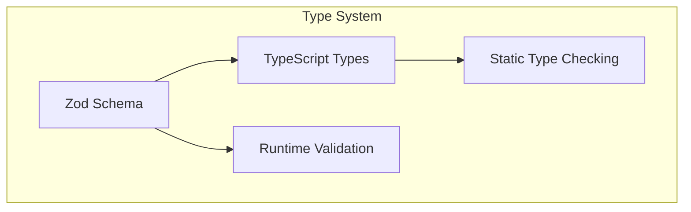
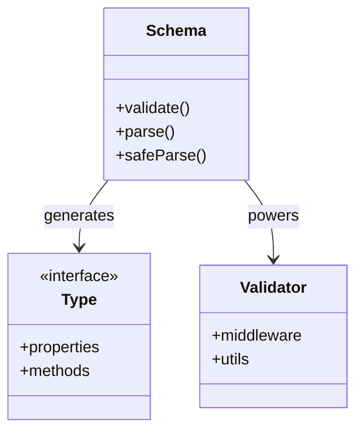
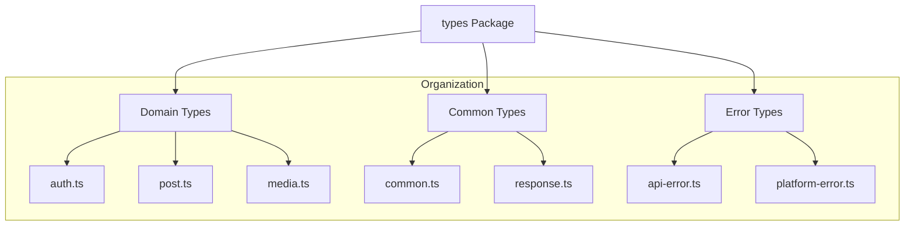

# Open Crosspost Proxy Service: Types and Schemas

## Overview

The type system provides a centralized, type-safe approach to data validation and type checking
across the entire application. Built around Zod schemas, it ensures consistency between runtime
validation and compile-time type checking.



## Architecture

### 1. Core Components



### 2. Package Structure



## Type Definitions

### 1. Domain Types

```typescript
// auth.ts
import { z } from 'zod';

export const AuthRequestSchema = z.object({
  platform: z.string(),
  successUrl: z.string().url().optional(),
  errorUrl: z.string().url().optional(),
}).describe('Authentication request');

export type AuthRequest = z.infer<typeof AuthRequestSchema>;
```

### 2. Response Types

```typescript
// response.ts
export const EnhancedResponseSchema = <T extends z.ZodTypeAny>(schema: T) =>
  z.object({
    success: z.boolean(),
    data: schema,
    meta: z.object({
      rateLimit: z.object({
        remaining: z.number(),
        reset: z.number(),
      }).optional(),
    }).optional(),
  });

export type EnhancedResponse<T> = z.infer<
  ReturnType<typeof EnhancedResponseSchema<z.ZodType<T>>>
>;
```

### 3. Error Types

```typescript
// errors/api-error.ts
export const ApiErrorSchema = z.object({
  code: z.enum(['VALIDATION_ERROR', 'AUTH_ERROR']),
  message: z.string(),
  details: z.record(z.unknown()).optional(),
});

export type ApiError = z.infer<typeof ApiErrorSchema>;
```

## Usage Patterns

### 1. API Validation

```typescript
// Middleware usage
app.use(async (c, next) => {
  const result = AuthRequestSchema.safeParse(await c.req.json());
  if (!result.success) {
    return c.json({ error: result.error }, 400);
  }
  return next();
});
```

### 2. SDK Integration

```typescript
// SDK client usage
export class TwitterClient {
  async createPost(
    request: PostCreateRequest,
  ): Promise<EnhancedResponse<PostResponse>> {
    // Implementation
  }
}
```

### 3. Error Handling

```typescript
// Error response creation
const createErrorResponse = (
  error: ApiError,
): EnhancedResponse<ErrorResponse> => ({
  success: false,
  data: {
    error: error.code,
    message: error.message,
    details: error.details,
  },
});
```

## Best Practices

### 1. Schema Definition

- Use descriptive schema names
- Add property descriptions
- Include validation rules
- Define clear error messages

### 2. Type Generation

- Derive types from schemas
- Use meaningful type names
- Document type constraints
- Maintain type exports

### 3. Validation

- Validate at system boundaries
- Use type guards when needed
- Handle validation errors
- Provide clear feedback

### 4. Organization

- Group by domain
- Maintain clear hierarchy
- Use index files
- Document relationships

## Implementation Examples

### 1. Request Validation

```typescript
export const PostCreateSchema = z.object({
  content: z.object({
    text: z.string().min(1).max(280),
    media: z.array(z.string().url()).optional(),
  }),
  platform: z.enum(['twitter']),
}).describe('Post creation request');

export type PostCreateRequest = z.infer<typeof PostCreateSchema>;
```

### 2. Response Formatting

```typescript
export const PostResponseSchema = z.object({
  id: z.string(),
  url: z.string().url(),
  timestamp: z.number(),
}).describe('Post creation response');

export type PostResponse = z.infer<typeof PostResponseSchema>;
```

### 3. Error Handling

```typescript
export const ErrorDetailSchema = z.object({
  code: z.enum(['RATE_LIMIT', 'INVALID_TOKEN']),
  message: z.string(),
  recoverable: z.boolean(),
}).describe('Error detail');

export type ErrorDetail = z.infer<typeof ErrorDetailSchema>;
```

## Benefits

1. **Type Safety**
   - Compile-time checking
   - Runtime validation
   - Error prevention

2. **Consistency**
   - Single source of truth
   - Unified validation
   - Clear contracts

3. **Developer Experience**
   - Auto-completion
   - Documentation
   - Error messages

4. **Maintainability**
   - Centralized types
   - Easy updates
   - Clear dependencies
